# APITemplate

[](https://github.com/zribktad/API-Template/actions/workflows/pr-validation.yml)

A scalable, clean, and modern template designed to jumpstart **.NET 10** Web API and Data-Driven applications. Built as a **Modular Monolith**, it provides a curated set of industry-standard libraries combining modern **REST** APIs with a robust **GraphQL** backend, bridging the gap between monolithic development speed and Clean Architecture principles within a single maintainable repository.

---

## 📚 How-To Guides

Step-by-step guides for the most common workflows in this project:

| Guide                                                    | Description                                                                 |
|----------------------------------------------------------|-----------------------------------------------------------------------------|
| [GraphQL Endpoint](docs/graphql-endpoint.md)             | Add a type, query, mutation, and optional DataLoader                        |
| [REST Endpoint](docs/rest-endpoint.md)                   | Full workflow: entity → DTO → validator → Wolverine handler → controller    |
| [EF Core Migration](docs/ef-migration.md)                | Create and apply PostgreSQL schema migrations                               |
| [MongoDB Migration](docs/mongodb-migration.md)           | Create index and data migrations with Kot.MongoDB.Migrations                |
| [Transactions](docs/transactions.md)                     | Wrap multiple operations in an atomic Unit of Work transaction              |
| [Authentication](docs/AUTHENTICATION.md)                 | JWT login flow, protecting endpoints, and production guidance               |
| [Keycloak auth workflow](docs/keycloak-auth-workflow.md) | User lifecycle: registration, invitations, account API, Keycloak webhooks   |
| [Stored Procedures](docs/stored-procedures.md)           | Add a PostgreSQL function and call it safely from C#                        |
| [MongoDB Polymorphism](docs/mongodb-polymorphism.md)     | Store multiple document subtypes in one collection                          |
| [Validation](docs/validation.md)                         | Add FluentValidation rules, cross-field rules, and shared validators        |
| [Specifications](docs/specifications.md)                 | Write reusable EF Core query specifications with Ardalis                    |
| [Scalar & GraphQL UI](docs/scalar-and-graphql-ui.md)     | Use the Scalar REST explorer and Nitro GraphQL playground                   |
| [Testing](docs/testing.md)                               | Write unit tests (services, validators, repositories) and integration tests |
| [Observability](docs/observability.md)                   | Run OpenTelemetry locally with Aspire Dashboard or Grafana LGTM             |
| [Caching](docs/CACHING.md)                               | Configure output caching, rate limiting, and DragonFly backing store        |
| [Result Pattern](docs/result-pattern.md)                 | Guidelines for introducing selective `Result<T>` flow in phase 2            |
| [Git Hooks](docs/GIT_HOOKS.md)                           | Auto-install Husky.Net hooks and format staged C# files with CSharpier      |

---

## 🚀 Key Features

* **Architecture Pattern:** Modular Monolith with Clean Architecture layering inside each module. Domain rules and interfaces are isolated from Application logic and Infrastructure.
* **Dual API Modalities:**
    * **REST API:** Clean HTTP endpoints using versioned controllers (`Asp.Versioning.Mvc`).
    * **GraphQL API:** Complex query batching via `HotChocolate`, integrated Mutations and DataLoaders to eliminate the N+1 problem.
* **Modern Interactive Documentation:** Native `.NET 10` OpenAPI integrations displayed smoothly in the browser using **Scalar** `/scalar`. Includes **Nitro UI** `/graphql/ui` for testing queries natively.
* **Dual Database Architecture:**
    * **PostgreSQL + EF Core 10:** Relational entities (Products, Categories, Reviews, Tenants, Users) with the Repository + Unit of Work pattern.
    * **MongoDB:** Semi-structured media metadata (ProductData) with a polymorphic document model and BSON discriminators.
* **Multi-Tenancy:** Every relational entity implements `IAuditableTenantEntity`. `AppDbContext` enforces per-tenant read isolation via global query filters (`TenantId == currentTenant && !IsDeleted`). New rows are automatically stamped with the current tenant from the request JWT.
* **Soft Delete with Cascade:** Delete operations are converted to soft-delete updates in `AppDbContext.SaveChangesAsync`. Cascade rules propagate soft-deletes to dependent entities without relying on database-level cascades.
* **Audit Fields:** All entities carry `AuditInfo` (owned EF type) with `CreatedAtUtc`, `CreatedBy`, `UpdatedAtUtc`, `UpdatedBy`. Fields are stamped automatically in `SaveChangesAsync`.
* **Optimistic Concurrency:** PostgreSQL native `xmin` system column configured as a concurrency token. `DbUpdateConcurrencyException` is mapped to HTTP 409 by `ApiExceptionHandler`.
* **Rate Limiting:** Fixed-window per-client rate limiter (`100 req/min` default). Partition key priority: JWT username → remote IP → `"anonymous"`. Returns HTTP 429 on breach.
* **Output Caching:** Tenant-isolated ASP.NET Core output cache backed by **DragonFly** (Redis-compatible). Mutations evict affected tags. Falls back to in-memory when `Redis:ConnectionString` is absent.
* **Domain Filtering:** Seamless filtering, sorting, and paging powered by `Ardalis.Specification` to decouple query models from infrastructural EF abstractions.
* **Background Jobs:** Recurring job scheduling via **TickerQ** with distributed coordination (Redis-backed leader election). Email retry logic runs as a recurring job.
* **Notifications:** Pluggable SMTP pipeline for transactional emails (user registration, role changes, tenant invitations).
* **File Storage:** Multipart file upload and download with streaming support.
* **Webhooks:** Outbound webhook delivery to registered consumer endpoints.
* **Real-time Streaming:** Server-Sent Events (SSE) endpoint for push notifications to connected clients.
* **Enterprise-Grade Utilities:**
    * **Validation:** Pipelined model validation using `FluentValidation.AspNetCore`.
    * **Cross-Cutting Concerns:** Unified configuration via `Serilog` and centralized exception handling via `IExceptionHandler` + RFC 7807 `ProblemDetails`.
    * **Data Redaction:** Sensitive log properties (PII, secrets) are classified with `Microsoft.Extensions.Compliance` (`[PersonalData]`, `[SensitiveData]`) and HMAC-redacted before writing.
    * **Authentication:** Pre-configured Keycloak JWT + BFF Cookie dual-auth with production hardening: secure-only cookies, server-side session store (`RedisTicketStore`) backed by DragonFly with an L1 in-process skip-window cache and Redis pub/sub revocation broadcast for cross-instance coherence, silent token refresh, and CSRF protection.
    * **Observability:** Health Checks (`/health`) natively tracking PostgreSQL, MongoDB, and DragonFly state.
* **Role-Based Access Control:** Three-tier role model (`PlatformAdmin`, `TenantAdmin`, `User`) enforced via Keycloak claims and ASP.NET Core policy-based authorization.
* **Robust Testing Engine:** Isolated Integration tests using `UseInMemoryDatabase` combined with `WebApplicationFactory` for fast feedback, **Testcontainers PostgreSQL** for high-fidelity tenant isolation, plus a comprehensive `Unit` test suite (Moq, Shouldly, FluentValidation.TestHelper).

---

## 🏗 Architecture Overview

The application is a **Modular Monolith** — a single deployable process composed of independently organized feature modules. Each module encapsulates its own domain, persistence, and application logic. Modules communicate through typed **Contracts** (interfaces + message types) rather than direct project references.

### Top-Level Structure

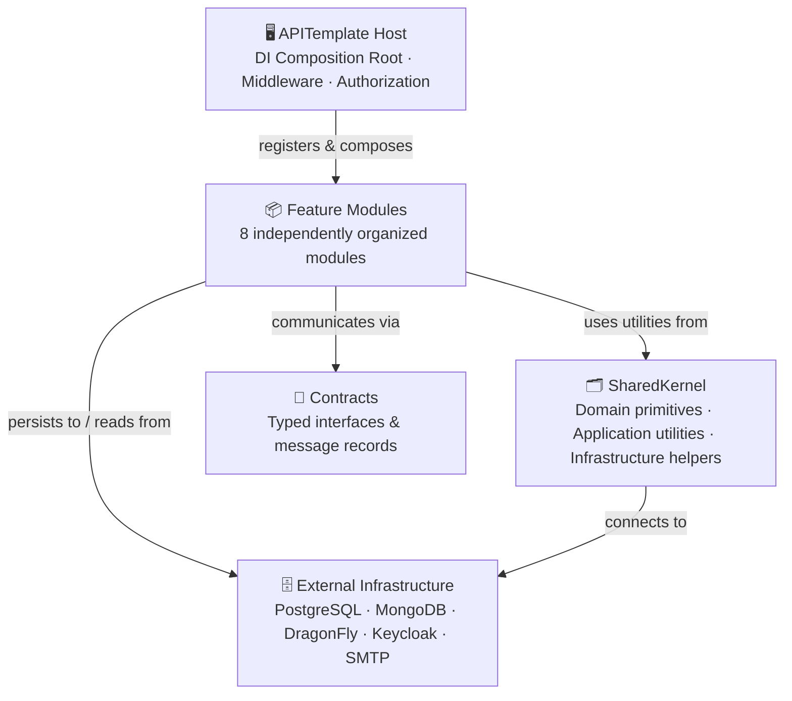

### Modules & Their Infrastructure Dependencies

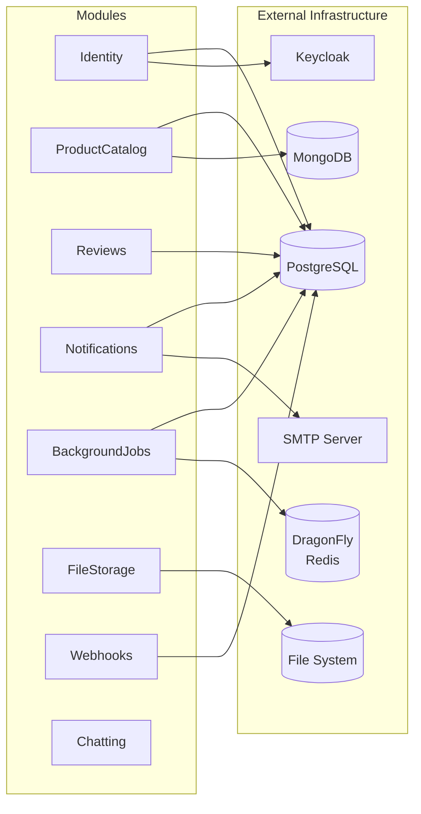

### SharedKernel Layers

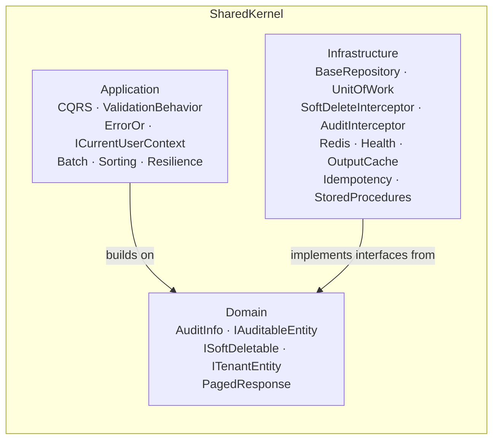

---

## 📦 Module Overview

Each module follows an internal **Clean Architecture** structure: Domain → Application (Features, Handlers) → Infrastructure (Persistence, Repositories, Services) — with no cross-module direct references. Modules expose behavior through **Contracts**.

| Module             | Primary Responsibility                                                                         | Database             | Key Technologies                                         |
|--------------------|------------------------------------------------------------------------------------------------|----------------------|----------------------------------------------------------|
| **Identity**       | Auth, BFF sessions, user registration, roles, tenant invitations, Keycloak sync                | PostgreSQL           | Keycloak OIDC, JWT, BFF Cookie, RedisTicketStore         |
| **ProductCatalog** | Products, categories, polymorphic media metadata, GraphQL                                      | PostgreSQL + MongoDB | EF Core, MongoDB.Driver, HotChocolate                    |
| **Reviews**        | Product reviews, rating aggregation                                                            | PostgreSQL           | EF Core, Ardalis.Specification                           |
| **Notifications**  | Transactional email delivery via SMTP pipeline, failed email store and retry                   | PostgreSQL           | Wolverine, ISmtpSendPipelineProvider, IFailedEmailStore  |
| **BackgroundJobs** | Recurring scheduled tasks: email retry, data cleanup, FTS reindex, external sync, job queue    | PostgreSQL (TickerQ) | TickerQ, distributed leader election (Redis), IMessageBus |
| **FileStorage**    | Multipart file upload and streaming download                                                   | File system / blob   | ASP.NET Core streaming, IFormFile                        |
| **Webhooks**       | Outbound HTTP callbacks to registered consumer endpoints                                       | PostgreSQL           | HttpClient, Wolverine, HMAC signing, channel queue       |
| **Chatting**       | Server-Sent Events push notifications to connected clients                                     | —                    | ASP.NET Core SSE, IAsyncEnumerable                       |

---

## 📐 Module Internal Structure

Every module follows the same internal folder convention, aligning with Clean Architecture without imposing separate projects:

```text
src/Modules/<ModuleName>/
├── Contracts/            # Public interfaces + message types exposed to other modules
├── Domain/               # Entities, value objects, domain exceptions, enums
├── Features/             # Vertical slices: Commands, Queries, Handlers (Wolverine)
├── Persistence/          # DbContext / MongoDbContext, EF configurations, migrations
├── Repositories/         # IRepository implementations
├── Services/             # Domain services, infrastructure adapters
├── Handlers/             # Cross-cutting Wolverine message handlers (events from other modules)
├── Logging/              # Structured log event definitions (LoggerMessage)
├── Options/              # IOptions<T> configuration classes
└── <ModuleName>Module.cs # DI registration + endpoint mapping entry point
```

---

## 🔗 Module Communication

Modules never reference each other's internal types directly. Cross-module communication happens through three mechanisms — all defined in `SharedKernel/Contracts/`:

- **Events** (`SharedKernel.Contracts.Events`) — fire-and-forget domain notifications published with `IMessageBus.PublishAsync`
- **Commands** (`SharedKernel.Contracts.Commands`) — targeted cross-module invocations dispatched with `IMessageBus.InvokeAsync`
- **Notifications.Contracts records** — typed messages passed through the Wolverine pipeline inside the Notifications module

### Flow 1 — Cascade soft-delete across modules

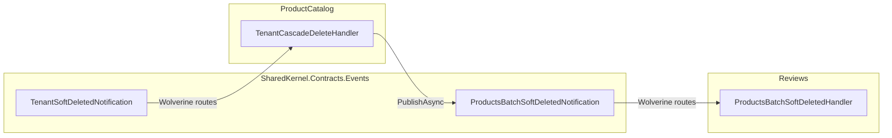

### Flow 2 — Transactional emails on domain events

Three domain events in `SharedKernel.Contracts.Events` each trigger a dedicated email handler in Notifications that assembles an `EmailMessage` and returns it as `OutgoingMessages` — Wolverine routes the message to `SendEmailMessageHandler` for delivery.

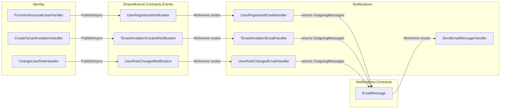

### Flow 3 — Background email retry

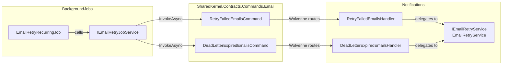

### Flow 4 — Scheduled data cleanup

`CleanupRecurringJob` (TickerQ, leader-elected) calls `ICleanupService`, which fans out three cross-module Wolverine commands and runs soft-delete purge locally using registered `ISoftDeleteCleanupStrategy` implementations.

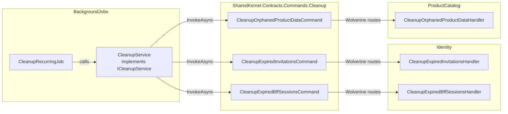

### Flow 5 — Job completion webhook callback

When a job finishes (success or failure), `JobProcessingBackgroundService` dispatches a `SendWebhookCallbackCommand` to the Webhooks module, which enqueues the payload for outgoing HTTP delivery.

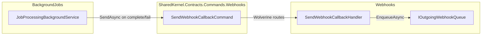

| Communication Style                    | When to use                                                          | Example                                                                     |
|----------------------------------------|----------------------------------------------------------------------|-----------------------------------------------------------------------------|
| **SharedKernel event + PublishAsync**  | Domain events crossing module boundaries (fire-and-forget)          | `TenantSoftDeletedNotification` → cascade delete products & categories      |
| **SharedKernel command + InvokeAsync** | BackgroundJobs or cross-module operations requiring a return/await   | `CleanupExpiredInvitationsCommand` → Identity cleans up invitations         |
| **SharedKernel command + SendAsync**   | Fire-and-forget dispatch to another module's infrastructure          | `SendWebhookCallbackCommand` → Webhooks enqueues outgoing callback          |
| **Notifications.Contracts record**     | Passing email data through the Wolverine pipeline inside Notifications | `EmailMessage` returned as `OutgoingMessages` → `SendEmailMessageHandler` |

---

## 🗂 SharedKernel

`SharedKernel` provides reusable building blocks that all modules consume. It is explicitly **not a module** — it contains no domain logic, no HTTP endpoints, and no business rules. It is a technical utility library.

### Domain layer utilities

| Component          | Location                 | Purpose                                              |
|--------------------|--------------------------|------------------------------------------------------|
| `AuditInfo`        | `Domain/AuditInfo.cs`    | Owned EF value object stamped on every entity        |
| `IAuditableEntity` | `Domain/Interfaces/`     | Marker for auto-audit stamping in `SaveChangesAsync` |
| `ISoftDeletable`   | `Domain/Interfaces/`     | Marker for soft-delete global query filter           |
| `ITenantEntity`    | `Domain/Interfaces/`     | Marker for per-tenant global query filter            |
| `PagedResponse<T>` | `Domain/PagedResponse.cs`| Typed paginated response wrapper                     |

### Application layer utilities

| Component               | Location                    | Purpose                                                      |
|-------------------------|-----------------------------|--------------------------------------------------------------|
| `ValidationBehavior<T>` | `Application/Validation/`   | Wolverine middleware: runs FluentValidation before handlers   |
| `AppError` / `ErrorOr`  | `Application/Errors/`       | Typed error result type for handler return values            |
| `ICurrentUserContext`   | `Application/Context/`      | Resolves current user ID and tenant ID from HTTP context     |
| `BatchRequest<T>`       | `Application/Batch/`        | Generic batch command input wrapper                          |
| `SortingOptions`        | `Application/Sorting/`      | Reusable sorting input for list queries                      |
| `SearchOptions`         | `Application/Search/`       | Reusable search/filter input for list queries                |
| `ResiliencePipelines`   | `Application/Resilience/`   | Polly-backed retry + circuit-breaker configurations          |

### Infrastructure layer utilities

| Component                     | Location                           | Purpose                                                          |
|-------------------------------|------------------------------------|------------------------------------------------------------------|
| `BaseRepository<T>`           | `Infrastructure/Repositories/`     | Generic EF Core repository base (GetById, Add, Update, Delete)   |
| `UnitOfWork`                  | `Infrastructure/UnitOfWork/`       | `IUnitOfWork` implementation with transaction + retry support    |
| `SoftDeleteInterceptor`       | `Infrastructure/SoftDelete/`       | EF Core interceptor converting hard deletes to soft deletes      |
| `AuditSaveChangesInterceptor` | `Infrastructure/Auditing/`         | EF Core interceptor stamping `AuditInfo` on save                 |
| `RedisConnectionFactory`      | `Infrastructure/Redis/`            | Shared `IConnectionMultiplexer` registration                     |
| `HealthCheckExtensions`       | `Infrastructure/Health/`           | Shared health check registrations (PostgreSQL, MongoDB, Dragonfly)|
| `OutputCacheExtensions`       | `Infrastructure/OutputCache/`      | Tenant-aware output cache policy base                            |
| `StoredProcedureBase`         | `Infrastructure/StoredProcedures/` | Base class for keyless EF entity stored-procedure calls          |
| `IdempotencyMiddleware`       | `Infrastructure/Idempotency/`      | Idempotency-key deduplication middleware                         |

---

## 📦 Domain Class Diagram

This class diagram models the aggregate roots and entities in the **ProductCatalog** and **Reviews** modules.

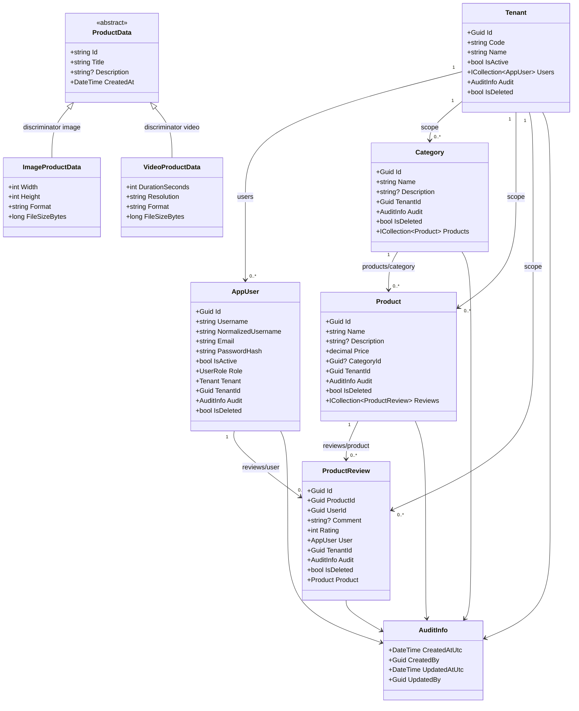

---

## 🛠 Technology Stack

| Category               | Technology / Library                                   | Version  |
|------------------------|--------------------------------------------------------|----------|
| **Runtime**            | .NET Web SDK                                           | 10.0     |
| **Relational DB**      | PostgreSQL (`Npgsql`)                                  | 18       |
| **Document DB**        | MongoDB (`MongoDB.Driver`)                             | 8        |
| **Cache / Session**    | DragonFly (Redis-compatible, `StackExchange.Redis`)    | 1.27     |
| **ORM**                | Entity Framework Core                                  | 10.0     |
| **API Toolkit**        | ASP.NET Core, `Asp.Versioning`, `Scalar.AspNetCore`    | 10.0     |
| **GraphQL**            | HotChocolate                                           | 15.1     |
| **Message Bus**        | WolverineFx (`IMessageBus`, CQRS dispatch)             | latest   |
| **Background Jobs**    | TickerQ (recurring job scheduler)                      | latest   |
| **Auth**               | Keycloak (JWT Bearer + BFF Cookie via OIDC)            | 26       |
| **Logging**            | Serilog (`Serilog.AspNetCore`)                         | latest   |
| **Validation**         | FluentValidation                                       | latest   |
| **Specifications**     | Ardalis.Specification + EF Core evaluator              | latest   |
| **MongoDB Migrations** | Kot.MongoDB.Migrations                                 | latest   |
| **Testing**            | xUnit 3, Moq, Shouldly, FluentValidation.TestHelper    | latest   |
| **Test Infra**         | Testcontainers.PostgreSql, Respawn                     | latest   |

---

## 📂 Project Structure

The solution is organized as a **Modular Monolith** with a clear separation between the host entry point, shared infrastructure, cross-module contracts, and self-contained feature modules.

```
src/
├── APITemplate/Api/         ← Host entry point (DI root, middleware, Program.cs)
├── SharedKernel/            ← Shared domain primitives and technical utilities
├── Contracts/               ← Inter-module typed interfaces and message records
└── Modules/
    ├── Identity/            ← Auth, BFF, users, roles, Keycloak
    ├── ProductCatalog/      ← Products, categories, product data, GraphQL
    ├── Reviews/             ← Product reviews
    ├── Notifications/       ← SMTP email pipeline
    ├── BackgroundJobs/      ← TickerQ recurring jobs
    ├── FileStorage/         ← File upload/download
    ├── Webhooks/            ← Outbound webhook callbacks
    └── Chatting/            ← SSE streaming

tests/
└── APITemplate.Tests/
    ├── Integration/         ← WebApplicationFactory + in-memory DB tests
    │   └── Postgres/        ← Testcontainers PostgreSQL tests
    └── Unit/
        ├── Services/
        ├── Repositories/
        ├── Validators/
        ├── Middleware/
        └── ExceptionHandling/
```

### Dependency rule in practice

```
Modules → SharedKernel
Modules → Contracts (interfaces only — no cross-module concrete references)
APITemplate host → all Modules (DI registration only)
```

- `BackgroundJobs` dispatches `RetryFailedEmailsCommand` via `IMessageBus` — it never imports `IEmailRetryService` or `EmailRetryService` from `Notifications`.
- `Notifications` implements the Wolverine handlers and `IEmailRetryService`, registered in DI inside the host's composition root.
- `APITemplate` host controllers reference only `IMessageBus` (Wolverine) — no direct dependency on any module's internal classes.

---

## 🌐 REST API Reference

All versioned REST resource endpoints sit under the base path `api/v{version}`. JWT `Authorization: Bearer <token>` is required for versioned API routes. Authentication is handled externally by Keycloak (see [Authentication](#-authentication) section). Utility endpoints such as `/health` and `/graphql/ui` are anonymous.

> **Rate limiting:** all controller routes require the `fixed` rate-limit policy (100 requests per minute per authenticated user or remote IP).

### Products

| Method   | Path                    | Auth | Description                                    |
|----------|-------------------------|:----:|------------------------------------------------|
| `GET`    | `/api/v1/Products`      |  ✅   | List products with filtering, sorting & paging |
| `GET`    | `/api/v1/Products/{id}` |  ✅   | Get a single product by GUID                   |
| `POST`   | `/api/v1/Products`      |  ✅   | Create a new product                           |
| `PUT`    | `/api/v1/Products/{id}` |  ✅   | Update an existing product                     |
| `DELETE` | `/api/v1/Products/{id}` |  ✅   | Soft-delete a product (cascades to reviews)    |

### Categories

| Method   | Path                            | Auth | Description                           |
|----------|---------------------------------|:----:|---------------------------------------|
| `GET`    | `/api/v1/Categories`            |  ✅   | List all categories                   |
| `GET`    | `/api/v1/Categories/{id}`       |  ✅   | Get a category by GUID                |
| `POST`   | `/api/v1/Categories`            |  ✅   | Create a new category                 |
| `PUT`    | `/api/v1/Categories/{id}`       |  ✅   | Update a category                     |
| `DELETE` | `/api/v1/Categories/{id}`       |  ✅   | Soft-delete a category                |
| `GET`    | `/api/v1/Categories/{id}/stats` |  ✅   | Aggregated stats via stored procedure |

### Product Reviews

| Method   | Path                                            | Auth | Description                          |
|----------|-------------------------------------------------|:----:|--------------------------------------|
| `GET`    | `/api/v1/ProductReviews`                        |  ✅   | List reviews with filtering & paging |
| `GET`    | `/api/v1/ProductReviews/{id}`                   |  ✅   | Get a review by GUID                 |
| `GET`    | `/api/v1/ProductReviews/by-product/{productId}` |  ✅   | All reviews for a given product      |
| `POST`   | `/api/v1/ProductReviews`                        |  ✅   | Create a new review                  |
| `DELETE` | `/api/v1/ProductReviews/{id}`                   |  ✅   | Soft-delete a review                 |

### Product Data (MongoDB)

| Method   | Path                         | Auth | Description                                |
|----------|------------------------------|:----:|--------------------------------------------|
| `GET`    | `/api/v1/product-data`       |  ✅   | List all or filter by `type` (image/video) |
| `GET`    | `/api/v1/product-data/{id}`  |  ✅   | Get by MongoDB ObjectId                    |
| `POST`   | `/api/v1/product-data/image` |  ✅   | Create image media metadata                |
| `POST`   | `/api/v1/product-data/video` |  ✅   | Create video media metadata                |
| `DELETE` | `/api/v1/product-data/{id}`  |  ✅   | Delete by MongoDB ObjectId                 |

### Files

| Method | Path                   | Auth | Description                              |
|--------|------------------------|:----:|------------------------------------------|
| `POST` | `/api/v1/files/upload` |  ✅   | Multipart file upload, returns file ID   |
| `GET`  | `/api/v1/files/{id}`   |  ✅   | Stream file download by ID               |

### Webhooks

| Method   | Path                    | Auth | Description                                     |
|----------|-------------------------|:----:|-------------------------------------------------|
| `POST`   | `/api/v1/webhooks`      |  ✅   | Register a consumer webhook endpoint            |
| `DELETE` | `/api/v1/webhooks/{id}` |  ✅   | Unregister a webhook endpoint                   |
| `GET`    | `/api/v1/webhooks`      |  ✅   | List registered webhooks for the current tenant |

### Chatting / SSE

| Method | Path                        | Auth | Description                                |
|--------|-----------------------------|:----:|--------------------------------------------|
| `GET`  | `/api/v1/sse/notifications` |  ✅   | Open an SSE stream to receive push events  |

### Identity — Users

| Method | Path                            | Auth | Description                                           |
|--------|---------------------------------|:----:|-------------------------------------------------------|
| `GET`  | `/api/v1/Users`                 |  ✅   | List all users (PlatformAdmin only)                   |
| `GET`  | `/api/v1/Users/{id}`            |  ✅   | Get a user by GUID                                    |
| `POST` | `/api/v1/Users/register`        |  ❌   | Register a new user                                   |
| `PUT`  | `/api/v1/Users/{id}/activate`   |  ✅   | Activate a user (TenantAdmin / PlatformAdmin)         |
| `PUT`  | `/api/v1/Users/{id}/deactivate` |  ✅   | Deactivate a user (TenantAdmin / PlatformAdmin)       |
| `PUT`  | `/api/v1/Users/{id}/role`       |  ✅   | Assign a role to a user (TenantAdmin / PlatformAdmin) |

### Utility

| Method | Path          | Auth | Description                                                                   |
|--------|---------------|:----:|-------------------------------------------------------------------------------|
| `GET`  | `/health`     |  ❌   | JSON health status for PostgreSQL, MongoDB & DragonFly                        |
| `GET`  | `/scalar`     |  ❌   | Interactive Scalar OpenAPI UI (**Development only** — disabled in Production) |
| `GET`  | `/graphql/ui` |  ❌   | HotChocolate Nitro GraphQL IDE                                                |

---

## ⚙️ Configuration Reference

All configuration lives in `appsettings.json` (production defaults) and is overridden by `appsettings.Development.json` locally or by environment variables at runtime.

**Override priority (highest → lowest):**

1. Environment variables (e.g. `ConnectionStrings__DefaultConnection=...`)
2. `appsettings.Development.json` (local development)
3. `appsettings.json` (production baseline — committed to source control, must not contain real secrets)

> **Security note:** Never commit real secrets to `appsettings.json`. Supply `Keycloak:credentials:secret`, database passwords, and any other sensitive values via environment variables, Docker secrets, or a secret manager such as Azure Key Vault.

Configuration sections are bound to strongly-typed `IOptions<T>` classes registered in DI (e.g. `RateLimitingOptions`, `CachingOptions`, `BffOptions`), so every setting is validated at startup and injectable into any service without raw `IConfiguration` access.

### Databases

| Key                                   | Example Value                                                                       | Description                                                                                                                                                           |
|---------------------------------------|-------------------------------------------------------------------------------------|-----------------------------------------------------------------------------------------------------------------------------------------------------------------------|
| `ConnectionStrings:DefaultConnection` | `Host=localhost;Port=5432;Database=apitemplate;Username=postgres;Password=postgres` | Npgsql connection string for the primary PostgreSQL database. Used by EF Core `AppDbContext` for all relational data (tenants, users, products, categories, reviews). |
| `MongoDB:ConnectionString`            | `mongodb://localhost:27017`                                                         | MongoDB connection string. Used by `MongoDbContext` for the `product_data` collection (polymorphic media metadata).                                                   |
| `MongoDB:DatabaseName`                | `apitemplate`                                                                       | Name of the MongoDB database. All MongoDB collections are created inside this database.                                                                               |

### Cache & Session

| Key                      | Example Value    | Description                                                                                                                                                                                                                                                                                                                              |
|--------------------------|------------------|------------------------------------------------------------------------------------------------------------------------------------------------------------------------------------------------------------------------------------------------------------------------------------------------------------------------------------------|
| `Redis:ConnectionString` | `localhost:6379` | StackExchange.Redis connection string pointing to a DragonFly instance. Used for: distributed output cache (GET responses), server-side BFF session store (`RedisTicketStore`), and shared DataProtection key ring. **Omit or leave empty** to fall back to in-memory cache — suitable for single-instance development only. |

### Authentication — Keycloak

| Key                           | Example Value            | Description                                                                                                                                                                                                  |
|-------------------------------|--------------------------|--------------------------------------------------------------------------------------------------------------------------------------------------------------------------------------------------------------|
| `Keycloak:auth-server-url`    | `http://localhost:8180/` | Base URL of the Keycloak server. Used for JWT token validation (OIDC discovery endpoint) and BFF OIDC login flow.                                                                                            |
| `Keycloak:realm`              | `api-template`           | Name of the Keycloak realm that issues tokens for this application.                                                                                                                                          |
| `Keycloak:resource`           | `api-template`           | Keycloak client ID. Must match the client configured in the realm. Used as the JWT `aud` (audience) claim.                                                                                                   |
| `Keycloak:credentials:secret` | `dev-client-secret`      | Keycloak client secret for the confidential client. Required for BFF OIDC code exchange and token refresh. **Never commit a real secret** — supply via environment variable or secret manager in production. |
| `Keycloak:SkipReadinessCheck` | `false`                  | When `true`, the startup `WaitForKeycloakAsync()` probe is skipped. Useful in CI environments where Keycloak is not available.                                                                               |

### BFF Cookie Session

| Key                                    | Example Value                                   | Description                                                                                                                                                                                    |
|----------------------------------------|-------------------------------------------------|------------------------------------------------------------------------------------------------------------------------------------------------------------------------------------------------|
| `Bff:CookieName`                       | `.APITemplate.Auth`                             | Name of the `httpOnly` session cookie issued after a successful BFF login. The cookie contains only a session key — the actual auth ticket is stored server-side in DragonFly.                 |
| `Bff:SessionIdleTimeoutMinutes`        | `60`                                            | How long the BFF session remains valid after the last activity (cookie + server-side).                                                                                                         |
| `Bff:CacheTtlMinutes`                  | `10`                                            | Redis (L2) cache TTL in minutes for the read-through session cache layer. On cache miss, the session is loaded from PostgreSQL.                                                                |
| `Bff:LocalCacheTtlSeconds`             | `10`                                            | Per-instance in-process (L1) session cache TTL in seconds. Skips the Redis round-trip for repeat reads; cross-instance coherence is maintained via the `bff:session:revocations` pub/sub channel. Set to `0` to disable the L1 cache. |
| `Bff:LocalCacheMaxEntries`             | `10000`                                         | Upper bound on entries kept in the L1 session cache (`MemoryCache.SizeLimit`).                                                                                                                 |
| `Bff:PostLogoutRedirectUri`            | `/`                                             | URI the browser is redirected to after `GET /api/v1/bff/logout` completes the Keycloak back-channel logout.                                                                                    |
| `Bff:Scopes`                           | `["openid","profile","email","offline_access"]` | OIDC scopes requested from Keycloak during the BFF login flow. `offline_access` is required for silent token refresh via refresh token.                                                        |
| `Bff:RefreshThresholdMinutes`          | `2`                                             | `CookieSessionRefresher` exchanges the refresh token when the access token will expire within this many minutes.                                                                               |
| `Bff:RefreshWaitTimeoutMilliseconds`   | `10000`                                         | Maximum time follower requests wait for an in-flight refresh before giving up.                                                                                                                 |
| `Bff:RefreshLockTimeoutMilliseconds`   | `9000`                                          | Distributed refresh lock TTL in milliseconds. Must be `< RefreshWaitTimeoutMilliseconds`.                                                                                                      |
| `Bff:RefreshResultTtlMilliseconds`     | `15000`                                         | How long the refresh coordinator result stays in Redis for late followers to read. Must be `>= RefreshWaitTimeoutMilliseconds`.                                                                 |
| `Bff:RevokeSessionOnRefreshFailure`    | `true`                                          | When `true`, a failed token refresh revokes only the current BFF session.                                                                                                                      |

### Rate Limiting

| Key                                | Example Value | Description                                                                                                                                                        |
|------------------------------------|---------------|--------------------------------------------------------------------------------------------------------------------------------------------------------------------|
| `RateLimiting:Fixed:PermitLimit`   | `100`         | Maximum number of requests allowed per client within a single window. Partition key: JWT username → remote IP → `"anonymous"`. Exceeded requests receive HTTP 429. |
| `RateLimiting:Fixed:WindowMinutes` | `1`           | Duration of the fixed rate-limit window in minutes. The counter resets at the end of each window.                                                                  |

### Output Caching

| Key                                   | Example Value | Description                                                                                                                                                                                                 |
|---------------------------------------|---------------|-------------------------------------------------------------------------------------------------------------------------------------------------------------------------------------------------------------|
| `Caching:ProductsExpirationSeconds`   | `30`          | Cache TTL for the `Products` output-cache policy applied to `GET /api/v1/Products` and `GET /api/v1/Products/{id}`. Entries are evicted immediately when any product mutation publishes a cache event.     |
| `Caching:CategoriesExpirationSeconds` | `60`          | Cache TTL for the `Categories` output-cache policy.                                                                                                                                                         |
| `Caching:ReviewsExpirationSeconds`    | `30`          | Cache TTL for the `Reviews` output-cache policy.                                                                                                                                                            |

### Persistence & Transactions

| Key                                          | Example Value   | Description                                                                                                                                                                                                                                   |
|----------------------------------------------|-----------------|-----------------------------------------------------------------------------------------------------------------------------------------------------------------------------------------------------------------------------------------------|
| `Persistence:Transactions:IsolationLevel`    | `ReadCommitted` | Default SQL isolation level for explicit `IUnitOfWork.ExecuteInTransactionAsync(...)` calls. Accepted values: `ReadUncommitted`, `ReadCommitted`, `RepeatableRead`, `Serializable`. Per-call overrides are possible via `TransactionOptions`. |
| `Persistence:Transactions:TimeoutSeconds`    | `30`            | Command timeout applied to the database connection while an explicit transaction is active.                                                                                                                                                   |
| `Persistence:Transactions:RetryEnabled`      | `true`          | Enables the Npgsql EF Core execution strategy that automatically retries the entire transaction block on transient failures.                                                                                                                   |
| `Persistence:Transactions:RetryCount`        | `3`             | Maximum number of retry attempts before the execution strategy gives up and re-throws.                                                                                                                                                        |
| `Persistence:Transactions:RetryDelaySeconds` | `5`             | Maximum back-off delay (in seconds) between retry attempts. Actual delay is randomised up to this value.                                                                                                                                      |

### Background Jobs

| Key                                           | Example Value | Description                                                                              |
|-----------------------------------------------|---------------|------------------------------------------------------------------------------------------|
| `BackgroundJobs:EmailRetry:CronExpression`    | `0 * * * *`   | Cron schedule for the email retry recurring job (default: every hour).                   |
| `BackgroundJobs:EmailRetry:MaxRetryAttempts`  | `5`           | Maximum number of send attempts before a failed email is discarded from the retry queue. |
| `BackgroundJobs:EmailRetry:RetryDelayMinutes` | `30`          | Minimum age (in minutes) a failed email must have before it is eligible for retry.       |

### Bootstrap & Identity

| Key                             | Example Value                          | Description                                                                                                                                                         |
|---------------------------------|----------------------------------------|---------------------------------------------------------------------------------------------------------------------------------------------------------------------|
| `Bootstrap:Tenant:Code`         | `default`                              | Short code of the seed tenant created automatically on first startup if no tenants exist yet. Used as the default tenant for the seeded admin user.                 |
| `Bootstrap:Tenant:Name`         | `Default Tenant`                       | Human-readable display name of the seed tenant.                                                                                                                     |
| `SystemIdentity:DefaultActorId` | `00000000-0000-0000-0000-000000000000` | Fallback `CreatedBy` / `UpdatedBy` GUID stamped in audit fields when no authenticated user is present (e.g. during startup seeding).                                |

### CORS

| Key                   | Example Value                                       | Description                                                                                                                                                                                      |
|-----------------------|-----------------------------------------------------|--------------------------------------------------------------------------------------------------------------------------------------------------------------------------------------------------|
| `Cors:AllowedOrigins` | `["http://localhost:3000","http://localhost:5173"]` | List of origins permitted by the default CORS policy. Add your SPA development server and production domain here. Requests from unlisted origins will be blocked by the browser preflight check. |

> **Security note:** `Keycloak:credentials:secret` must be supplied via an environment variable or secret manager in production — never from a committed config file.

---

## 🔐 Authentication

Authentication is handled by **Keycloak** using a hybrid approach that supports both **JWT Bearer tokens** (for API clients and Scalar) and **BFF Cookie sessions** (for SPA frontends).

| Flow           | Use Case                                   | How it works                                                                                                                              |
|----------------|--------------------------------------------|-------------------------------------------------------------------------------------------------------------------------------------------|
| **JWT Bearer** | Scalar UI, API clients, service-to-service | `Authorization: Bearer <token>` header                                                                                                    |
| **BFF Cookie** | SPA frontend                               | `/api/v1/bff/login` → Keycloak login → session cookie → `GET /api/v1/bff/csrf` → direct API calls with cookie + `X-CSRF` header |

### BFF Authentication Flow

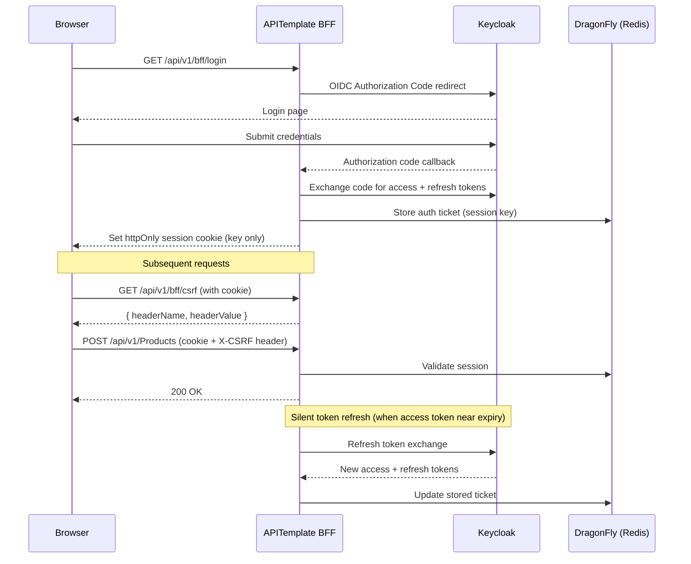

### BFF Production Hardening

| Feature                        | Detail                                                                                                                              |
|--------------------------------|-------------------------------------------------------------------------------------------------------------------------------------|
| **Secure cookie**              | `CookieSecurePolicy.Always` in production; `SameAsRequest` in development                                                           |
| **Server-side session store**  | `RedisTicketStore` serialises the auth ticket to DragonFly — the cookie contains only a GUID key                                   |
| **Shared DataProtection keys** | Keys persisted to DragonFly under `DataProtection:Keys` so multiple instances can decrypt each other's cookies                      |
| **Silent token refresh**       | `CookieSessionRefresher.OnValidatePrincipal` exchanges the refresh token when the access token is within 2 min of expiry            |
| **CSRF protection**            | `CsrfValidationMiddleware` requires a valid session-bound `X-CSRF` header on non-GET/HEAD/OPTIONS requests for cookie-auth requests |
| **Distributed refresh lock**   | Redis-based leader election prevents multiple concurrent refresh calls for the same session                                         |

### BFF Endpoints

| Method | Path                 | Auth | Description                                                      |
|--------|----------------------|:----:|------------------------------------------------------------------|
| `GET`  | `/api/v1/bff/login`  |  ❌   | Redirects to Keycloak login page                                 |
| `GET`  | `/api/v1/bff/logout` |  🍪  | Signs out from both cookie and Keycloak                          |
| `GET`  | `/api/v1/bff/user`   |  🍪  | Returns current user info (id, username, email, tenantId, roles) |
| `GET`  | `/api/v1/bff/csrf`   |  🍪  | Returns `headerName` + Data Protection `headerValue` for CSRF    |

### Role-Based Access Control

| Role            | Scope           | Capabilities                                                          |
|-----------------|-----------------|-----------------------------------------------------------------------|
| `PlatformAdmin` | All tenants     | Full read/write access to all tenants, users, and resources           |
| `TenantAdmin`   | Own tenant only | Manage users, activate/deactivate accounts, assign roles within tenant |
| `User`          | Own tenant only | Read/write own data (products, reviews) — no user management          |

### Manual Testing Guide

#### Option A: Scalar UI with OAuth2 (recommended)

1. Start the infrastructure:
   ```bash
   docker compose up -d
   ```
2. Run the API (via VS Code debugger or CLI):
   ```bash
   dotnet run --project src/APITemplate
   ```
3. Open **Scalar UI**: `http://localhost:5174/scalar`
4. Click the **Authorize** button in Scalar
5. You will be redirected to Keycloak — log in with `admin` / `Admin123`
6. After successful login, Scalar will automatically attach the JWT token to all requests
7. Try any endpoint (e.g. `GET /api/v1/Products`)

#### Option B: BFF Cookie flow (browser)

1. Open `http://localhost:5174/api/v1/bff/login` in a browser
2. Log in with `admin` / `Admin123` on the Keycloak page
3. After redirect, call API endpoints directly in the browser — the session cookie is sent automatically
4. Check your session: `http://localhost:5174/api/v1/bff/user`

#### Option C: Direct token via cURL

```bash
# Get a token from Keycloak (requires Direct Access Grants enabled on the client)
TOKEN=$(curl -s -X POST http://localhost:8180/realms/api-template/protocol/openid-connect/token \
  -d "grant_type=password&client_id=api-template&client_secret=dev-client-secret&username=admin&password=Admin123" \
  | jq -r '.access_token')

# Use the token
curl -H "Authorization: Bearer $TOKEN" http://localhost:5174/api/v1/products
```

> **Note:** Direct Access Grants (password grant) is disabled by default. Enable it in Keycloak Admin (`http://localhost:8180/admin` → api-template client → Settings) if needed.

---

## ⚡ GraphQL API

GraphQL is provided by the **ProductCatalog** module via **HotChocolate 15.1**. It is mounted at `/graphql` with the Nitro IDE at `/graphql/ui`.

### DataLoaders (N+1 Problem Solved)

By leveraging HotChocolate's built-in **DataLoaders** pipeline (`ProductReviewsByProductDataLoader`), fetching deeply nested parent-child relationships avoids querying the database `n` times. The framework collects IDs requested within the GraphQL query, then queries PostgreSQL precisely *once*.

**Example GraphQL Query:**

```graphql
query {
  products(input: { pageNumber: 1, pageSize: 10 }) {
    items {
      id
      name
      price
      # Below triggers ONE bulk DataLoader fetch under the hood!
      reviews {
        reviewerName
        rating
      }
    }
    pageNumber
    pageSize
    totalCount
  }
}
```

**Example GraphQL Mutation:**

```graphql
mutation {
  createProducts(input: {
    items: [
      {
        name: "New Masterpiece Board Game"
        price: 49.99
        description: "An epic adventure game"
      }
    ]
  }) {
    successCount
    failureCount
  }
}
```

### GraphQL Security & Performance Guards

| Guard                         | Setting   | Purpose                                           |
|-------------------------------|-----------|---------------------------------------------------|
| `MaxPageSize`                 | 100       | Prevents unbounded result sets                    |
| `DefaultPageSize`             | 20        | Sensible default for clients                      |
| `AddMaxExecutionDepthRule(5)` | depth ≤ 5 | Prevents deeply nested query attacks              |
| `AddAuthorization()`          | enabled   | Enables `[Authorize]` on GraphQL fields/mutations |

---

## 🏆 Design Patterns & Best Practices

### 1 — Message Dispatch + CQRS (WolverineFx)

All application logic is dispatched through **WolverineFx**. Controllers and GraphQL resolvers never call services directly — they send a typed command or query object through `IMessageBus`, and Wolverine routes it to the correct handler by convention.

```
Controller / GraphQL Resolver
        │  bus.InvokeAsync<T>(new GetProductsQuery(filter))
        ▼
    Wolverine pipeline
        │  FluentValidation middleware (UseFluentValidation())  ← validation runs here
        ▼
    Handler (static HandleAsync method)
        │  dependencies injected as method parameters
        ▼
    Response returned to caller
```

```csharp
public sealed record GetProductsQuery(ProductFilter Filter);

public sealed class GetProductsQueryHandler
{
    public static async Task<ProductsResponse> HandleAsync(
        GetProductsQuery query,
        IProductRepository repository,
        CancellationToken ct)
    {
        return await repository.GetPagedAsync(
            new ProductSpecification(query.Filter), query.Filter.PageNumber, query.Filter.PageSize, ct);
    }
}
```

Controllers inject only `IMessageBus` — they have no reference to any service or repository:

```csharp
public sealed class ProductsController(IMessageBus bus) : ApiControllerBase
{
    [HttpGet]
    public async Task<ActionResult<ProductsResponse>> GetAll(
        [FromQuery] ProductFilter filter, CancellationToken ct)
        => Ok(await bus.InvokeAsync<ProductsResponse>(new GetProductsQuery(filter), ct));
}
```

### 2 — Repository + Unit of Work Pattern

Every data-store interaction is hidden behind a typed interface defined in `SharedKernel/Domain/Interfaces/`. Application handlers depend only on `IProductRepository`, `ICategoryRepository`, etc., while `IUnitOfWork` is the only commit boundary for relational persistence.

```csharp
// Wraps two repository writes in a single database transaction
await _unitOfWork.ExecuteInTransactionAsync(async () =>
{
    await _productRepository.AddAsync(product);
    await _reviewRepository.AddAsync(review);
});
// Both rows committed or both rolled back
```

Per-call transaction options:

```csharp
await _unitOfWork.ExecuteInTransactionAsync(
    async () =>
    {
        await _productRepository.AddAsync(product, ct);
        await _reviewRepository.AddAsync(review, ct);
    },
    ct,
    new TransactionOptions
    {
        IsolationLevel = IsolationLevel.Serializable,
        TimeoutSeconds = 15,
        RetryEnabled = false
    });
```

### 3 — Specification Pattern (Ardalis.Specification)

Query logic — filtering, ordering, pagination — lives in reusable `Specification<T, TResult>` classes rather than being scattered across services or repositories.

```csharp
public sealed class ProductSpecification : Specification<Product, ProductResponse>
{
    public ProductSpecification(ProductFilter filter)
    {
        Query.ApplyFilter(filter);
        Query.OrderByDescending(p => p.CreatedAt)
             .Select(p => new ProductResponse(...));
        Query.Skip((filter.PageNumber - 1) * filter.PageSize)
             .Take(filter.PageSize);
    }
}
```

### 4 — FluentValidation with Auto-Validation

Models are validated automatically by Wolverine's `UseFluentValidation()` middleware before the handler body executes. FluentValidation supports dynamic, cross-field business rules:

```csharp
public abstract class ProductRequestValidatorBase<T> : AbstractValidator<T>
    where T : IProductRequest
{
    protected ProductRequestValidatorBase()
    {
        // Cross-field: Description is required only for expensive products
        RuleFor(x => x.Description)
            .NotEmpty().WithMessage("Description is required for products priced above 1000.")
            .When(x => x.Price > 1000);
    }
}
```

### 5 — Global Exception Handling (IExceptionHandler + ProblemDetails)

`ApiExceptionHandler` converts typed `AppException` instances into RFC 7807 `ProblemDetails` responses.

| Exception type                 | HTTP Status | Logged at |
|--------------------------------|-------------|-----------|
| `NotFoundException`            | 404         | Warning   |
| `ValidationException`          | 400         | Warning   |
| `ForbiddenException`           | 403         | Warning   |
| `ConflictException`            | 409         | Warning   |
| `DbUpdateConcurrencyException` | 409         | Warning   |
| Anything else                  | 500         | Error     |

**Error code catalog:**

| Code                   | HTTP | Meaning                                  |
|------------------------|------|------------------------------------------|
| `GEN-0001`             | 500  | Unknown/unhandled server error           |
| `GEN-0400`             | 400  | Generic validation failure               |
| `GEN-0404`             | 404  | Generic resource not found               |
| `GEN-0409`             | 409  | Generic conflict                         |
| `GEN-0409-CONCURRENCY` | 409  | Optimistic concurrency conflict          |
| `AUTH-0403`            | 403  | Forbidden                                |
| `PRD-0404`             | 404  | Product not found                        |
| `CAT-0404`             | 404  | Category not found                       |
| `REV-0404`             | 404  | Review not found                         |
| `REV-2101`             | 404  | Product not found when creating a review |

### 6 — Multi-Tenancy & Audit

All relational entities implement `IAuditableTenantEntity` (combines `ITenantEntity`, `IAuditableEntity`, `ISoftDeletable`). `AppDbContext` automatically:

- **Applies global query filters** on every read: `!entity.IsDeleted && entity.TenantId == currentTenant`.
- **Stamps audit fields** on Add (`CreatedAtUtc`, `CreatedBy`) and Modify (`UpdatedAtUtc`, `UpdatedBy`).
- **Auto-assigns TenantId** on insert from the JWT claim resolved by `HttpTenantProvider`.
- **Converts hard deletes to soft deletes**, running registered `ISoftDeleteCascadeRule` implementations to propagate to dependents.

### 7 — Background Jobs (TickerQ)

The **BackgroundJobs** module uses **TickerQ** for recurring scheduled jobs backed by PostgreSQL as a durable job store. A distributed lock (Redis-backed leader election) ensures only one instance runs the job at a time in a multi-replica deployment.

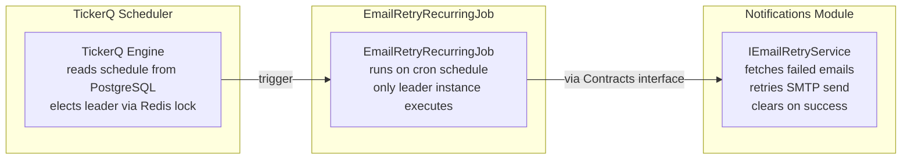

### 8 — Polyglot Persistence Decision Guide

| Data characteristic                 | Recommended store             |
|-------------------------------------|-------------------------------|
| Relational data with foreign keys   | PostgreSQL                    |
| Fixed, well-defined schema          | PostgreSQL                    |
| ACID transactions across tables     | PostgreSQL                    |
| Complex aggregations / reporting    | PostgreSQL + stored procedure |
| Semi-structured or evolving schemas | MongoDB                       |
| Polymorphic document hierarchies    | MongoDB                       |
| Media metadata, logs, audit events  | MongoDB                       |

### 9 — Output Caching (Tenant-Isolated, DragonFly-backed)

GET endpoints on Products, Categories, and Reviews use `[OutputCache(PolicyName = ...)]` with `TenantAwareOutputCachePolicy`. This policy:

1. **Enables caching for authenticated requests** (ASP.NET Core's default skips Authorization-header requests).
2. **Varies the cache key by tenant ID** so one tenant never receives another tenant's cached response.

Mutations publish cache invalidation events via `IMessageBus.PublishAsync` → dedicated handler evicts the affected output-cache tags.

### 10 — Automatic Schema Migration at Startup

`UseDatabaseAsync()` runs EF Core migrations, auth bootstrap seeding, and MongoDB migrations automatically on startup — no manual `dotnet ef database update` step required in production.

```csharp
await dbContext.Database.MigrateAsync();   // PostgreSQL (skipped for InMemory provider)
await seeder.SeedAsync();                  // bootstrap tenant + admin user
await migrator.MigrateAsync();             // MongoDB (Kot.MongoDB.Migrations)
```

### 11 — Multi-Stage Docker Build

```
Stage 1 (build)   — mcr.microsoft.com/dotnet/sdk:10.0     ← includes compiler tools
Stage 2 (publish) — same SDK, runs dotnet publish -c Release
Stage 3 (final)   — mcr.microsoft.com/dotnet/aspnet:10.0  ← runtime only, ~60 MB
```

---

## 🗄 Stored Procedure Pattern (EF Core + PostgreSQL)

EF Core's `FromSql()` lets you call stored procedures while still getting full object materialisation and parameterised queries.

### When to use a stored procedure

| Situation                           | Use LINQ | Use Stored Procedure |
|-------------------------------------|----------|----------------------|
| Simple CRUD filtering / paging      | ✅        |                      |
| Complex multi-table aggregations    |          | ✅                    |
| Reusable DB-side business logic     |          | ✅                    |
| Query needs full EF change tracking | ✅        |                      |

### Repository call via `FromSql`

```csharp
public Task<ProductCategoryStats?> GetStatsByIdAsync(Guid categoryId, CancellationToken ct = default)
{
    // The interpolated {categoryId} is converted to a @p0 parameter by EF Core —
    // never use string concatenation here.
    return AppDb.ProductCategoryStats
        .FromSql($"SELECT * FROM get_product_category_stats({categoryId})")
        .FirstOrDefaultAsync(ct);
}
```

---

## 🍃 MongoDB Polymorphic Pattern (ProductData)

The `ProductData` feature demonstrates a **polymorphic document model** in MongoDB, where a single collection stores two distinct subtypes (`ImageProductData`, `VideoProductData`) using the BSON discriminator pattern.

```csharp
[BsonDiscriminator(RootClass = true)]
[BsonKnownTypes(typeof(ImageProductData), typeof(VideoProductData))]
public abstract class ProductData { ... }

[BsonDiscriminator("image")]
public sealed class ImageProductData : ProductData { ... }

[BsonDiscriminator("video")]
public sealed class VideoProductData : ProductData { ... }
```

MongoDB stores a `_t` discriminator field automatically, enabling polymorphic queries against the single `product_data` collection.

### MongoDB vs PostgreSQL decision guide

| Situation                           | Use PostgreSQL | Use MongoDB |
|-------------------------------------|----------------|-------------|
| Relational data with foreign keys   | ✅              |             |
| Fixed, well-defined schema          | ✅              |             |
| ACID transactions across tables     | ✅              |             |
| Semi-structured or evolving schemas |                | ✅           |
| Polymorphic document hierarchies    |                | ✅           |
| Media metadata, logs, events        |                | ✅           |

---

## 🚀 CI/CD & Deployments

**GitHub Actions / Azure Pipelines Structure:**

1. **Restore:** `dotnet restore APITemplate.slnx`
2. **Build:** `dotnet build --no-restore APITemplate.slnx`
3. **Test:** `dotnet test --no-build APITemplate.slnx`
4. **Publish Container:** `docker build -t apitemplate-image:1.0 -f src/APITemplate/Api/Dockerfile .`
5. **Push Registry:** `docker push <registry>/apitemplate-image:1.0`

Because the application encompasses the database (natively via DI) and HTTP context fully self-contained using containerization, it scales efficiently behind Kubernetes Ingress (Nginx) or any App Service / Container Apps equivalent, maintaining state natively using PostgreSQL and MongoDB.

---

## 🧪 Testing

The repository maintains an inclusive combination of **Unit Tests** and **Integration Tests** executing over a seamless Test-Host infrastructure.

### Test structure

| Folder                                            | Technology                          | What it tests                                                                          |
|---------------------------------------------------|-------------------------------------|----------------------------------------------------------------------------------------|
| `tests/APITemplate.Tests/Unit/Services/`          | xUnit + Moq                         | Service business logic in isolation                                                    |
| `tests/APITemplate.Tests/Unit/Repositories/`      | xUnit + Moq                         | Repository filtering/query logic                                                       |
| `tests/APITemplate.Tests/Unit/Validators/`        | xUnit + FluentValidation.TestHelper | Validator rules per DTO                                                                |
| `tests/APITemplate.Tests/Unit/ExceptionHandling/` | xUnit + Moq                         | Explicit `errorCode` mapping and exception-to-HTTP conversion in `ApiExceptionHandler` |
| `tests/APITemplate.Tests/Integration/`            | xUnit + `WebApplicationFactory`     | Full HTTP round-trips over in-memory database                                          |
| `tests/APITemplate.Tests/Integration/Postgres/`   | xUnit + Testcontainers.PostgreSql   | Tenant isolation and transaction behaviour against a real PostgreSQL instance          |

### Integration test isolation

`CustomWebApplicationFactory` replaces the Npgsql provider with `UseInMemoryDatabase`, removes `MongoDbContext`, and registers a mocked `IProductDataRepository` so DI validation passes. Each test class gets its own database name (a fresh `Guid`) so tests never share state.

```csharp
// Each factory instance gets its own isolated in-memory database
private readonly string _dbName = Guid.NewGuid().ToString();
services.AddDbContext<AppDbContext>(options =>
    options.UseInMemoryDatabase(_dbName));
```

### Running tests

```bash
# Run all tests
dotnet test

# Run only unit tests
dotnet test --filter "FullyQualifiedName~Unit"

# Run only integration tests (in-memory, no external dependencies)
dotnet test --filter "FullyQualifiedName~Integration&Category!=Integration.Postgres"

# Run Testcontainers PostgreSQL tests (requires Docker)
dotnet test --filter "Category=Integration.Postgres"

# Run Smoke and Docker integration tests (requires a running Docker engine for Testcontainers)
dotnet test /p:RunDockerIntegration=true
```

> **Test category filter:** By default, tests tagged `Category=Integration.Docker` and `Category=Smoke` are excluded from every `dotnet test` run. These tests spin up PostgreSQL and MongoDB via Testcontainers — a running Docker engine is required. Set `RunDockerIntegration=true` to opt in and run them.

---

## 🏃 Getting Started

### Prerequisites

* [.NET 10 SDK installed locally](https://dotnet.microsoft.com/)
* [Docker Desktop](https://www.docker.com/) (Optional, convenient for running infrastructure).

### Quick Start (Using Docker Compose)

The template consists of a ready-to-use Docker environment to spool up PostgreSQL, MongoDB, Keycloak, DragonFly, and the built API container:

```bash
# Start up all services including the API container
docker compose up -d --build
```

> The API will bind natively to `http://localhost:8080`.

### Running Locally without Containerization

Start the infrastructure services only, then run the API on the host:

```bash
# Start only the databases and Keycloak
docker compose up -d postgres mongodb keycloak dragonfly
```

Apply your connection strings in `src/APITemplate/Api/appsettings.Development.json`, then run:

```bash
dotnet run --project src/APITemplate.Api
```

EF Core migrations and MongoDB migrations run automatically at startup — no manual `dotnet ef database update` needed.

### Available Endpoints & User Interfaces

Once fully spun up under a Development environment, check out:

- **Interactive REST API Documentation (Scalar):** `http://localhost:<port>/scalar`
- **Native GraphQL IDE (Nitro UI):** `http://localhost:<port>/graphql/ui`
- **Environment & Database Health Check:** `http://localhost:<port>/health`
