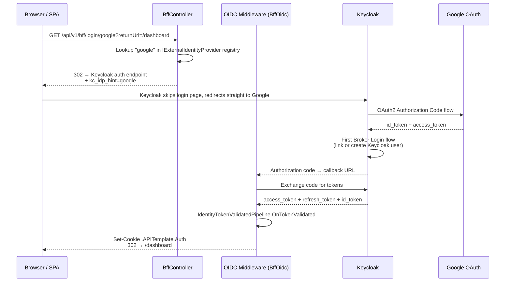
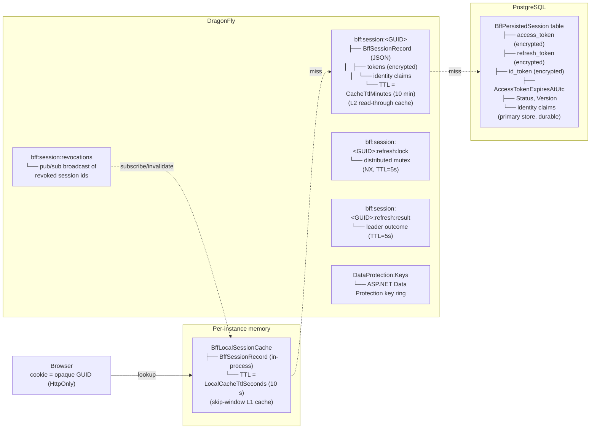

# Authentication & Authorization

## Overview

Project uses **Keycloak** as identity provider with hybrid authentication:

> **Related doc:** [Keycloak auth workflow](keycloak-auth-workflow.md) focuses on user lifecycle (registration, invitations, account endpoints, webhooks). This document focuses on protocols, BFF session storage, tokens, and local infrastructure.

> **Where things register:** For DI/middleware ownership and ordering (`AddApplicationComposition` vs `AddIdentityModule`, CSRF placement), see [auth-registration.md](auth-registration.md).

- **JWT Bearer** — direct API access (microservices, mobile apps, Postman, curl)
- **OIDC + Cookie (BFF)** — browser-based login for SPA; tokens never exposed to JavaScript
- **Scalar OAuth2** — interactive OAuth2 Authorization Code flow in Scalar UI (development)
- **Client Credentials** — machine-to-machine (service accounts, background jobs)

## Architecture

```mermaid
graph TB
    subgraph Clients
        SPA[Browser / SPA]
        API_CLIENT[API Client<br/>Postman, microservice, mobile]
        SCALAR[Scalar UI<br/>dev tool]
    end

    subgraph APP[ASP.NET Core API]
        BFF[BffController<br/>/api/v1/bff/login<br/>/api/v1/bff/login/{idpHint}<br/>/api/v1/bff/external-providers<br/>/api/v1/bff/logout<br/>/api/v1/bff/user<br/>/api/v1/bff/csrf]
        JWT_VAL[JwtBearer Middleware<br/>validates Bearer token]
        COOKIE_VAL[Cookie Middleware<br/>L1 in-process cache → Redis → PostgreSQL]
        REFRESH[CookieSessionRefresher<br/>loads session, delegates to<br/>BffTokenRefreshService]
        CSRF[CsrfValidationMiddleware<br/>X-CSRF token required]
        TENANT[IdentityTokenValidatedPipeline<br/>validates tenant_id claim]
        CLAIM[KeycloakClaimMapper<br/>maps Keycloak → .NET claims]
        AUTHZ[Authorization Middleware<br/>Fallback: Bearer OR Cookie]
    end

    subgraph POSTGRES[PostgreSQL]
        PG_STORE[BffPersistedSession table<br/>primary session store<br/>tokens encrypted at rest]
    end

    subgraph LOCAL[Per-Instance In-Process Cache]
        L1[BffLocalSessionCache<br/>IMemoryCache, 10s TTL<br/>invalidated via Redis pub/sub]
    end

    subgraph SESSION[DragonFly / Redis]
        CACHE[Redis Cache<br/>bff:session:GUID → BffSessionRecord<br/>read-through cache, 10 min TTL]
        LOCK[Refresh Coordinator<br/>bff:session:GUID:refresh:lock<br/>bff:session:GUID:refresh:result]
        REVOKE[Revocation Channel<br/>bff:session:revocations<br/>pub/sub broadcast]
        DP[DataProtection Keys<br/>DataProtection:Keys]
    end

    subgraph KEYCLOAK[Keycloak :8180]
        REALM[Realm: api-template<br/>Client: api-template]
    end

    SPA -->|Cookie .APITemplate.Auth| COOKIE_VAL
    SPA -->|POST/PUT/DELETE + X-CSRF| CSRF
    API_CLIENT -->|Authorization: Bearer token| JWT_VAL
    SCALAR -->|OAuth2 Authorization Code| REALM
    BFF -->|OIDC Code Flow| REALM
    JWT_VAL --> TENANT --> CLAIM --> AUTHZ
    COOKIE_VAL --> L1
    L1 -.->|miss| CACHE
    CACHE -.->|miss| PG_STORE
    REVOKE -. subscribe .-> L1
    COOKIE_VAL --> REFRESH
    REFRESH -->|grant_type=refresh_token| REALM
    REFRESH --> LOCK
    REFRESH --> CSRF --> AUTHZ
```

---

## Authentication Methods

| Method                 | Client                         | Token visible to JS?                                             |
| ---------------------- | ------------------------------ | ---------------------------------------------------------------- |
| **Scalar OAuth2**      | Scalar UI (dev tool)           | Yes (in Scalar memory only)                                      |
| **JWT Bearer**         | Mobile apps, Postman, curl     | Yes (client manages it)                                          |
| **Client Credentials** | Microservices, background jobs | N/A (machine-to-machine)                                         |
| **BFF Cookie**         | SPA frontend (browser)         | **No** — httpOnly cookie, tokens in PostgreSQL (L2 Redis cache + L1 per-instance cache) |

---

## Quick Start

### 1. Start Infrastructure

```bash
docker compose up -d
```

| Service    | Port  | Description           |
| ---------- | ----- | --------------------- |
| PostgreSQL | 5432  | Application database  |
| MongoDB    | 27017 | Product data storage  |
| Keycloak   | 8180  | Identity provider     |
| DragonFly  | 6379  | Session store + cache |

> **PostgreSQL 18+ volume mount:** The `postgres` service uses `postgres:18.3`. Since PostgreSQL 18, the declared Docker volume moved from `/var/lib/postgresql/data` to `/var/lib/postgresql`, and `PGDATA` defaults to a version-specific subdirectory (`/var/lib/postgresql/18/docker`). The `docker-compose.yml` mounts at `/var/lib/postgresql` intentionally — this is correct for PostgreSQL 18+. Do not change it to `/var/lib/postgresql/data`.

> **Keycloak database — first-time setup:** Keycloak shares the `postgres` service and uses a dedicated `keycloak` database within it. The init script (`infrastructure/postgres/init-keycloak-db.sql`) creates this database automatically on the **first** volume initialization. If the `pgdata` volume already existed before this change, create the database once manually:
> ```bash
> docker exec api-template-monolith-postgres-1 psql -U postgres -c "CREATE DATABASE keycloak;"
> ```
> After that, restart Keycloak: `docker compose restart keycloak`.

### 2. Default Credentials

| Service                | Username | Password |
| ---------------------- | -------- | -------- |
| Keycloak Admin Console | admin    | admin    |
| Application User       | admin    | admin    |

Default user has role **PlatformAdmin** and tenant `00000000-0000-0000-0000-000000000001`.

### 3. Keycloak Admin Console

```
http://localhost:8180/admin
```

---

## Flow 1 — JWT Bearer (API clients, mobile apps)

```
Client (Postman, mobile app, microservice)
│
│  Step 1: Get token from Keycloak
│  POST http://localhost:8180/realms/api-template/protocol/openid-connect/token
│  grant_type=authorization_code | client_credentials | refresh_token
│
│  Step 2: Call API with token
│  GET /api/v1/products
│  Authorization: Bearer <access_token>
│
▼
[ JwtBearer Middleware ]
  - Downloads JWKS from Keycloak discovery endpoint
  - Validates token signature, issuer, audience, lifetime
▼
[ IdentityTokenValidatedPipeline.OnTokenValidated ]
  - KeycloakClaimMapper: preferred_username → ClaimTypes.Name
  - KeycloakClaimMapper: realm_access.roles[] → ClaimTypes.Role[]
  - Rejects token without tenant_id claim (unless service account)
▼
[ Authorization Middleware ]
  - Fallback policy: requires authenticated user (Bearer OR Cookie)
  - PlatformAdmin: requires role "PlatformAdmin"
▼
Controller Action
```

```mermaid
sequenceDiagram
    participant C as Client
    participant KC as Keycloak
    participant API as ASP.NET Core API

    C->>KC: POST /token<br/>(grant_type=authorization_code | client_credentials | refresh_token)
    KC-->>C: access_token
    C->>API: GET /api/v1/products<br/>Authorization: Bearer &lt;token&gt;
    API->>API: JwtBearer Middleware<br/>validates signature, issuer, audience, lifetime
    API->>API: IdentityTokenValidatedPipeline.OnTokenValidated<br/>maps claims, validates tenant_id
    API->>API: Authorization Middleware<br/>Fallback: Bearer OR Cookie
    API-->>C: 200 OK
```

## How to Request a Token Manually (Postman / cURL)

The key endpoint for obtaining a token across all flows is (for the local environment):  
`POST http://localhost:8180/realms/api-template/protocol/openid-connect/token`

Below are all the supported methods (Grant Types) to obtain a token:

### 1. Password Grant (Resource Owner Password Credentials)
**What it does:** The client application collects the username and password directly and sends them in a single REST API POST request to Keycloak to receive tokens. It completely bypasses the Keycloak login UI.
**When to use:** 
- **✅ YES:** Local development, quick manual testing via Postman/cURL, and automated E2E/integration tests where simulating a browser login flow is too complex or slow.
- **❌ NO:** Never use this in production apps (SPAs, mobile apps). Users should never enter their Keycloak credentials directly into your client application.

This method allows you to send the username and password directly and receive a JWT token immediately.  
*(Note: Requires the client to have "Direct Access Grants" enabled in Keycloak).*

```bash
curl -X POST "http://localhost:8180/realms/api-template/protocol/openid-connect/token" \
  -H "Content-Type: application/x-www-form-urlencoded" \
  -d "grant_type=password" \
  -d "client_id=api-template" \
  -d "client_secret=dev-client-secret" \
  -d "username=admin" \
  -d "password=admin"
```

### 2. Client Credentials (Machine-to-Machine)

**What it does:** The client application authenticates *itself* (not a human user) using its `client_id` and `client_secret`. Keycloak verifies the client and issues an access token representing the machine/service, which will have no human user context.

**When to use:** 
- **✅ YES:** Background workers (CRON jobs), microservice-to-microservice communication, or any automated system that needs to call the API on its own behalf (as a Service Account) without any human user being present.

```bash
# Get the token and store it directly in a variable (bash)
TOKEN=$(curl -s -X POST "http://localhost:8180/realms/api-template/protocol/openid-connect/token" \
  -H "Content-Type: application/x-www-form-urlencoded" \
  -d "grant_type=client_credentials" \
  -d "client_id=api-template" \
  -d "client_secret=dev-client-secret" \
  | jq -r '.access_token')

# Use the token to call our API
curl -H "Authorization: Bearer $TOKEN" http://localhost:5174/api/v1/products
```

### 3. Refresh Token
**What it does:** Instead of credentials, the client sends a previously obtained, long-lived `refresh_token`. Keycloak validates it and issues a fresh, short-lived `access_token` (and typically a rotated `refresh_token`), effectively extending the session without requiring user interaction.
**When to use:** 
- **✅ YES:** When your client application (mobile app, or backend BFF) needs to seamlessly maintain the user's session without forcing them to log in again after the short-lived `access_token` (e.g., 5 minutes) expires.

Provide the `refresh_token` (which you received during the initial login) to Keycloak to get a completely new pair of tokens.

```bash
curl -X POST "http://localhost:8180/realms/api-template/protocol/openid-connect/token" \
  -H "Content-Type: application/x-www-form-urlencoded" \
  -d "grant_type=refresh_token" \
  -d "client_id=api-template" \
  -d "client_secret=dev-client-secret" \
  -d "refresh_token=<YOUR_REFRESH_TOKEN>"
```

### 4. Authorization Code (with PKCE)

**What it does:** A secure, multi-step flow where the application never sees the user's credentials.

1. The app redirects the user to the Keycloak login page.
2. After successful login, Keycloak redirects back to the app with a temporary, one-time "authorization code".
3. The app exchanges this code on the backend for the actual tokens. (The PKCE extension adds a cryptographic challenge to ensure the client exchanging the code is the exact same one that requested it.)

**When to use:** 
- **✅ YES:** User-facing interactive applications like Single Page Applications (React, Vue), native Mobile apps (iOS, Android), Desktop applications (Windows WPF, MAUI, Electron), and our Scalar UI developer documentation. This is the modern security standard for logging in users.

For security, it requires redirecting to the browser where the user logs in securely on the Keycloak screen. The client then intercepts a temporary "authorization code" from the URL parameters and exchanges it for the actual token.

**To simulate this in Postman:**
1. In the Authorization tab, select Type: **OAuth 2.0**
2. Select Grant Type: **Authorization Code (With PKCE)**
3. Callback/Redirect URL: (Depends on your client, e.g., `http://localhost:5174/scalar/v1`)
4. Auth URL: `http://localhost:8180/realms/api-template/protocol/openid-connect/auth`
5. Access Token URL: `http://localhost:8180/realms/api-template/protocol/openid-connect/token`
6. Client ID: `api-template` (or `api-template-public` if you have one)
7. Client Secret: (Can be left blank/is not required for a PKCE client)
8. Scope: `openid profile email`
9. Click **Get New Access Token** – Postman will open a secure Keycloak login window for you.

### 5. Direct Grant / Mobile & Desktop App Login (Alternative for Native UI)
**What it does:** Similar to the Password Grant, it allows a mobile or desktop application to send the username and password directly to Keycloak from its own native UI without bouncing the user to a browser. *Note: Using an embedded/system browser with PKCE (Method 4) is generally the recommended modern approach for both mobile and desktop apps.*
**When to use:**
- **✅ YES:** In a native mobile or desktop application (iOS, Android, Windows WPF, MAUI) where you absolutely must build your own login screen natively, and you have configured a specific `public` client in Keycloak (e.g., `api-template-public`) that has "Direct Access Grants" enabled.

```bash
# Notice there is no client_secret because a native app is an untrusted "public" client
curl -X POST "http://localhost:8180/realms/api-template/protocol/openid-connect/token" \
  -H "Content-Type: application/x-www-form-urlencoded" \
  -d "grant_type=password" \
  -d "client_id=api-template-public" \
  -d "username=user@example.com" \
  -d "password=mypassword"
```

> **Tip:** Copy the obtained `access_token` and paste it into [jwt.io](https://jwt.io). This allows you to inspect all claims (e.g., roles, `tenant_id`, etc.) that the API parses from Keycloak.

---

## Flow 2 — Social Login via Google (BFF + Keycloak IdP brokering)

Users can log in with Google without leaving the BFF cookie flow. Keycloak acts as the broker — it handles the Google OAuth exchange and issues a standard Keycloak token to the app.

### 2a. Direct redirect to Google



**What is `kc_idp_hint`:**  
`kc_idp_hint` is a Keycloak-specific query parameter added to the OIDC authorization URL. When Keycloak receives this parameter, it **skips its own login page entirely** and redirects the user straight to the specified external identity provider (e.g. Google, GitHub). The value must match the **Alias** configured in Keycloak Admin Console → Identity Providers (e.g. `google`, `github`).

Without `kc_idp_hint`: `User → BFF /login → Keycloak login page → user clicks "Login with Google" → Google`  
With `kc_idp_hint=google`: `User → BFF /login/google → Keycloak (skipped) → Google directly`

**How it flows through the code:**

1. SPA calls `GET /api/v1/bff/login/google`
2. `BffController.LoginWithProvider` looks up `"google"` in registered `IExternalIdentityProvider` implementations
3. Sets `AuthenticationProperties.Items["kc_idp_hint"] = "google"`
4. Issues OIDC `Challenge` — ASP.NET builds the Keycloak authorization URL
5. `IdentityModule.ConfigureOidc` → `OnRedirectToIdentityProvider` event reads `kc_idp_hint` from `Properties.Items` and appends it as a query parameter to the authorization URL
6. Keycloak receives `?kc_idp_hint=google` and immediately redirects to Google OAuth

### 2b. Discovery endpoint (SPA dynamic UI)

```
GET /api/v1/bff/external-providers   (AllowAnonymous)

Response:
[
  { "idpHint": "google", "displayName": "Google" }
]
```

The SPA calls this endpoint on startup to render social login buttons dynamically — no hardcoded provider list in the frontend.

### 2c. Adding a new social provider

1. Implement `IExternalIdentityProvider` in `Identity.Security.ExternalIdentityProviders`
2. Register as singleton in `IdentityModule.RegisterApplicationServices`
3. Add the corresponding IdP in Keycloak Admin Console (or realm JSON)

No changes needed in `BffController` or `IdentityModule.ConfigureOidc`.

### 2d. Keycloak Google IdP Setup

**Development (docker compose):**

```bash
# Set before docker compose up
export GOOGLE_CLIENT_ID=your-client-id.apps.googleusercontent.com
export GOOGLE_CLIENT_SECRET=your-client-secret
docker compose restart keycloak
```

The realm JSON imports the Google IdP automatically on first start. The `${GOOGLE_CLIENT_ID:-CHANGE_ME}` placeholder is replaced by Keycloak at runtime.

**Google Cloud Console:**

1. Create OAuth 2.0 Client ID (Web application type)
2. Authorized redirect URI:
   ```
   http://localhost:8180/realms/api-template/broker/google/endpoint
   ```
3. Copy Client ID + Secret → set env vars above

**After first Google login:**  
`IdentityTokenValidatedPipeline.OnTokenValidated` → `UserProvisioningService.ProvisionIfNeededAsync` fires. The user must have an accepted `TenantInvitation` for their Google email to be provisioned into a tenant.

---

## Flow 3 — BFF Cookie (SPA / browser)

### 3a. Login

```mermaid
sequenceDiagram
    participant SPA as Browser / SPA
    participant BFF as BffController
    participant OIDC as OIDC Middleware (BffOidc)
    participant KC as Keycloak
    participant VK as DragonFly

    SPA->>BFF: GET /api/v1/bff/login?returnUrl=/dashboard
    BFF-->>SPA: 302 → Keycloak login page (Challenge BffOidc)
    SPA->>KC: User enters credentials
    KC-->>OIDC: Authorization code → callback URL
    OIDC->>KC: Exchange code for tokens
    KC-->>OIDC: access_token + refresh_token + id_token
    OIDC->>OIDC: IdentityTokenValidatedPipeline.OnTokenValidated<br/>maps claims, validates tenant_id
    OIDC->>OIDC: RedisTicketStore.StoreAsync<br/>→ BffSessionService.CreateSessionAsync
    Note over VK: BffSessionRecord created:<br/>tokens encrypted via IDataProtector<br/>PostgreSQL = primary, Redis = cache
    OIDC->>VK: Store BffPersistedSession (PostgreSQL)<br/>+ Redis cache (TTL = CacheTtlMinutes)
    OIDC-->>SPA: Set-Cookie: .APITemplate.Auth=&lt;GUID&gt;<br/>HttpOnly, SameSite=Lax, Secure<br/>302 → /dashboard
```

**Session record contents** — the cookie carries only the opaque `SessionId` (GUID). The server-side `BffPersistedSession` in PostgreSQL (cached in Redis) contains:

| Field                                                 | Description                                                                |
| ----------------------------------------------------- | -------------------------------------------------------------------------- |
| `SessionId`                                           | Opaque GUID used as cookie value and store lookup key                      |
| `UserId`, `Subject`                                   | User and IdP subject identifiers                                           |
| `Provider`                                            | Identity provider type (`Keycloak`)                                        |
| `TenantId`, `Roles`, `Email`, `DisplayName`           | Identity claims projected from the OIDC ticket                             |
| `AccessToken`, `RefreshToken`, `IdToken`              | **Encrypted at rest** via `IDataProtector` (purpose: `bff:session:tokens`) |
| `AccessTokenExpiresAtUtc`                             | When the current access token expires                                      |
| `CreatedAtUtc`, `LastSeenAtUtc`, `LastRefreshedAtUtc` | Lifecycle timestamps                                                       |
| `Status`                                              | `Active`, `Refreshing`, `Revoked`, or `Expired`                            |
| `Version`                                             | Optimistic concurrency counter (incremented on every mutation)             |
| `RevokedAtUtc`, `RevocationReason`                    | Populated when session is revoked                                          |

### 3b. Authenticated Request (with proactive token refresh)

```mermaid
sequenceDiagram
    participant SPA as Browser / SPA
    participant CM as Cookie Middleware
    participant VK as DragonFly
    participant CSR as CookieSessionRefresher
    participant TRS as BffTokenRefreshService
    participant COORD as RedisBffRefreshCoordinator
    participant KC as Keycloak
    participant CSRF as CsrfValidationMiddleware
    participant AUTHZ as Authorization Middleware

    SPA->>CM: POST /api/v1/products<br/>Cookie: .APITemplate.Auth=&lt;GUID&gt;<br/>X-CSRF: &lt;token&gt;
    CM->>VK: RedisTicketStore.RetrieveAsync(&lt;GUID&gt;)<br/>→ BffSessionService.GetTicketAsync
    VK-->>CM: BffSessionRecord → AuthenticationTicket
    CM->>CSR: ValidatePrincipal event
    CSR->>VK: GetSessionAsync(sessionId)
    VK-->>CSR: BffSessionRecord (or null → 401)
    CSR->>TRS: RefreshIfRequiredAsync(session)

    alt AccessTokenExpiresAtUtc - now ≤ RefreshThresholdMinutes (2 min)
        TRS->>COORD: ExecuteAsync(sessionId, leader, follower)

        alt Leader (acquired distributed lock)
            COORD->>VK: SET bff:session:GUID:refresh:lock NX TTL=5s
            TRS->>KC: POST /token (grant_type=refresh_token)
            KC-->>TRS: new access_token + refresh_token (rotated)
            TRS->>VK: TryUpdateAsync(updatedSession, expectedVersion)<br/>optimistic concurrency check
            COORD->>VK: Write outcome to bff:session:GUID:refresh:result TTL=5s
            COORD->>VK: Release lock (compare-and-delete)
        else Follower (lock already held)
            COORD->>VK: SUBSCRIBE bff:session:GUID:refresh:notify
            COORD->>VK: Early GET bff:session:GUID:refresh:result (already written?)
            COORD->>VK: Await pub/sub notification or timeout (RefreshWaitTimeoutMilliseconds)
            COORD->>VK: Final GET bff:session:GUID:refresh:result
            COORD->>VK: Reload updated BffSessionRecord via followerAction
        end

        CSR->>CSR: Rebuild principal from BffSessionRecord<br/>ShouldRenew = true → new cookie issued
    else Token still fresh
        TRS-->>CSR: BffRefreshOutcome.NotRequired
    else Refresh token missing or Keycloak rejected
        TRS->>VK: RevokeAsync(sessionId, reason)
        CSR-->>SPA: 401 Unauthorized (RejectPrincipal)
    end

    CSR->>CSRF: Validate X-CSRF header<br/>(GET/HEAD/OPTIONS exempt; JWT Bearer exempt)
    alt Missing X-CSRF header
        CSRF-->>SPA: 403 Forbidden
    end
    CSRF->>AUTHZ: Bearer OR Cookie authenticated
    AUTHZ-->>SPA: Controller Action → 200 OK
```

**Refresh coordination** prevents concurrent requests from all hitting Keycloak when the token expires:

### 3b.1 Session validation cadence and revocation window

`CookieSessionRefresher.ValidatePrincipal` stores the last successful validation timestamp (`.last_validated`) in cookie properties.

- If the timestamp is younger than 1 minute, refresh checks are skipped for that request.
- Server-side session presence is still validated on every request, so revoked/deleted sessions are rejected immediately.
- This reduces database/cache pressure for high request rates.
- Trade-off: Keycloak refresh/rotation checks are interval-based, not per-request.

Use this behavior when you want immediate revocation enforcement while still reducing refresh pressure.

| Role                             | Behavior                                                                                                                                                                                     |
| -------------------------------- | -------------------------------------------------------------------------------------------------------------------------------------------------------------------------------------------- |
| **Leader**                       | Acquires Redis distributed lock (`NX`, TTL = `RefreshLockTimeoutMilliseconds`), calls Keycloak, updates session with `TryUpdateAsync` (optimistic concurrency), writes outcome to result key |
| **Follower**                     | Polls the result key every 100ms (up to `RefreshWaitTimeoutMilliseconds`), then reloads the updated session                                                                                  |
| **Fallback** (Redis unavailable) | In-memory semaphore per session — followers wait on the leader's `Task<BffRefreshOutcome>`                                                                                                   |

**Keycloak refresh status mapping:**

| `KeycloakRefreshStatus`                | Action                                                                       |
| -------------------------------------- | ---------------------------------------------------------------------------- |
| `Success`                              | Update session with new tokens, set `Status = Active`, bump `Version`        |
| `Rejected` (`invalid_grant`)           | Revoke session (`RefreshRejected`) if `RevokeSessionOnRefreshFailure = true` |
| `ProviderError` (HTTP/network failure) | Revoke session (`ProviderSessionInvalid`) if configured                      |

### 3c. Logout

```mermaid
sequenceDiagram
    participant SPA as Browser / SPA
    participant BFF as BffController
    participant VK as DragonFly
    participant KC as Keycloak

    SPA->>BFF: GET /api/v1/bff/logout<br/>Cookie: .APITemplate.Auth=&lt;GUID&gt;
    BFF->>VK: RedisTicketStore.RemoveAsync(&lt;GUID&gt;)<br/>→ BffSessionService.RevokeAsync(Logout)
    Note over VK: Session soft-deleted in PostgreSQL<br/>removed from Redis cache<br/>(RevocationReason = Logout)
    BFF-->>SPA: Clear cookie .APITemplate.Auth
    BFF-->>SPA: 302 → Keycloak end_session_endpoint
    SPA->>KC: End session (SSO invalidated)
    KC-->>SPA: 302 → PostLogoutRedirectUri (/)
```

### 3d. Session revocation

Revocation means the session is **soft-deleted in PostgreSQL**, **removed from the Redis L2 cache**, and **broadcast on the `bff:session:revocations` pub/sub channel** so every instance evicts its per-process L1 entry within milliseconds (see [§ 3e.i](#3ei-l1-local-cache-and-redis-pubsub-invalidation)). The `BffPersistedSession` is marked with `IsDeleted = true` and `Status = Revoked`, `RevokedAtUtc`, and `RevocationReason` populated. Any subsequent request that loads a revoked session gets rejected immediately (`BffSessionService.GetSessionAsync` returns `null` for revoked sessions).

This is intentional — keeping the record allows:
- **Audit trail**: the reason and timestamp of revocation remain in PostgreSQL for 24h (cleanup job retention)
- **No race conditions**: concurrent requests see the soft-deleted status rather than a missing row
- **Consistent behavior**: the session is permanently deleted by the hourly cleanup job after the retention window

**Revocation reasons:**

| `BffSessionRevocationReason`  | Trigger                                                                                                                                                               |
| ----------------------------- | --------------------------------------------------------------------------------------------------------------------------------------------------------------------- |
| `Logout`                      | User-initiated sign-out via `/api/v1/bff/logout`                                                                                                                      |
| `RefreshRejected`             | Keycloak returned `invalid_grant` (e.g. refresh token rotated and old one reused)                                                                                     |
| `RefreshTokenMissing`         | Session record has no refresh token — cannot renew                                                                                                                    |
| `RefreshTokenReplaySuspected` | Suspicious refresh token reuse detected (reserved for future use)                                                                                                     |
| `SessionCorrupted`            | Session record is malformed — missing `SessionId`, `UserId`, `Subject`, or `AccessToken`                                                                              |
| `ProviderSessionInvalid`      | Keycloak HTTP/network error during refresh (non-`invalid_grant` failure)                                                                                              |
| `AbsoluteLifetimeExceeded`    | `CreatedAtUtc + SessionAbsoluteLifetimeMinutes` (480 min) has passed                                                                                                  |
| `CredentialRotation`          | Password change or global sign-out: `POST /api/v1/account/password`, `POST /api/v1/account/sessions/revoke-all`, or `POST /internal/keycloak-events/password-changed` |

**Account password change (`POST /api/v1/account/password`):** The handler verifies the current password by calling Keycloak’s token endpoint with the **resource-owner password grant** using the confidential client configured under `Keycloak:PasswordVerification` (`client_id` / `client_secret` in application settings; see realm client `api-template-password-verification` in the template). **Direct Access Grants must be enabled for that server-side client** in Keycloak. If this grant is disabled, `ValidateCredentialsAsync` will fail and password change returns a validation error even when the password is correct. Production realms that disable password grants for end-user clients should still allow them for this dedicated verification client only.

### 3e. Storage architecture and Redis cache keys

**PostgreSQL** is the primary durable session store (`BffPersistedSession` table). **Redis/DragonFly** acts as a read-through L2 cache with short TTL (`CacheTtlMinutes`, default 10 min). **Each application instance** also keeps a per-process L1 cache (`BffLocalSessionCache`, `IMemoryCache`-backed, default 10 s TTL) so repeated requests for the same session skip the Redis round-trip entirely. L1 coherence across instances is maintained by a Redis pub/sub revocation broadcast. This design supports offline sessions (`offline_access` scope) — the refresh token in PostgreSQL survives Redis restarts and long idle periods (up to 30 days).

| Layer               | Key / Table                       | Content                                             | TTL                                          | Set by                              |
| ------------------- | --------------------------------- | --------------------------------------------------- | -------------------------------------------- | ----------------------------------- |
| L1 (in-process)     | `bff:session:{id}`                | `BffSessionRecord` (plaintext, per-instance)        | `LocalCacheTtlSeconds` (10 s), absolute      | `CachingBffSessionStoreDecorator`   |
| L2 (Redis)          | `bff:session:{id}`                | `BffSessionRecord` as JSON (tokens encrypted)       | `CacheTtlMinutes` (10 min), **sliding**      | `PostgresCachedBffSessionStore`     |
| PostgreSQL          | `BffPersistedSession`             | Full session entity, tokens encrypted               | No TTL (cleanup job)                         | `PostgresCachedBffSessionStore`     |
| Redis (refresh)     | `bff:session:{id}:refresh:lock`   | Lock owner identifier (`machine:pid:guid`)          | `RefreshLockTimeoutMilliseconds` (5s), fixed | `RedisBffRefreshCoordinator`        |
| Redis (refresh)     | `bff:session:{id}:refresh:result` | Refresh outcome JSON (`{succeeded, failureReason}`) | `RefreshResultTtlMilliseconds` (5s), fixed   | `RedisBffRefreshCoordinator`        |
| Redis (pub/sub)     | `bff:session:revocations`         | Revoked session id (plain string)                   | N/A (broadcast)                              | `RedisBffSessionRevocationNotifier` |

**Read path:** L1 hit → return. L1 miss → L2 (Redis) hit → populate L1 → return. L2 miss → load from PostgreSQL → populate L2 + L1 → return.

**Write path:** Write to PostgreSQL (primary) → write to Redis (L2) → update or invalidate L1 through `CachingBffSessionStoreDecorator`. Terminal mutations (`RemoveAsync`, `TryUpdateAsync` with `Status = Revoked | Expired`, `BulkRevokeActiveSessionsBySubjectAsync`) also publish the affected session id to `bff:session:revocations`.

### 3e.i. L1 local cache and Redis pub/sub invalidation

Without an L1 cache, every authenticated request paid a Redis `GET`. The L1 cache (`BffLocalSessionCache`, backed by `IMemoryCache`) collapses repeated reads of the same session into an in-memory dictionary lookup. Because L1 is per-process, a revocation on instance A would otherwise go unseen on instance B until L1's TTL expired. To close that window, the store is wrapped in `CachingBffSessionStoreDecorator` which publishes every terminal mutation over a single Redis pub/sub broadcast channel; on every instance, `BffSessionRevocationSubscriber` (registered as an `IHostedService`) listens on that channel and invalidates the matching L1 entry.

**Coherence rules applied by the decorator:**

| Mutation                                                 | L1 action                                  | Pub/sub publish |
| -------------------------------------------------------- | ------------------------------------------ | --------------- |
| `StoreAsync` (initial sign-in)                           | Write new record to L1                     | No              |
| `TryUpdateAsync` with `Status = Active` (token refresh)  | Write-through: replace L1 record           | Yes             |
| `TryUpdateAsync` with `Status = Revoked \| Expired`      | Invalidate L1 entry                        | Yes             |
| `RemoveAsync` (logout / `RedisTicketStore` eviction)     | Invalidate L1 entry                        | Yes             |
| `BulkRevokeActiveSessionsBySubjectAsync` (password change, revoke-all) | Invalidate L1 entry per session id | Yes, one message per session |
| `GetAsync` on L1 miss                                    | Populate L1 with the record returned by L2 | No              |

**Why a single broadcast channel (`bff:session:revocations`) rather than per-session channels?** Each instance needs a constant number of subscriptions regardless of how many sessions are in its L1. Messages for sessions not present in the local cache translate into a cheap dictionary no-op; the volume of revocation events is bounded by logout/password-change/revoke-all activity, which is low.

**Failure modes:**

- **Redis disconnected:** `RedisBffSessionRevocationNotifier` logs a warning and returns without throwing. Peer instances fall back to TTL-bounded eviction (≤ `LocalCacheTtlSeconds`). StackExchange.Redis auto-reconnect restores the subscription when Redis comes back.
- **Malformed pub/sub message:** The subscriber logs a warning and ignores the message. One bad message cannot disable the subscription.
- **Redis not configured at all (`Redis:ConnectionString` empty):** `NullBffSessionRevocationNotifier` is registered and the hosted subscriber is not. The L1 cache still works locally; cross-instance staleness is bounded by TTL only. This mirrors the existing `InProcessBffRefreshCoordinator` fallback pattern.

**Why subscribe in `StartAsync`, not `ExecuteAsync`?** `IHostedService.StartAsync` is awaited by the host before HTTP traffic is accepted, so the subscription is guaranteed to be active before the first request. Deferring the subscribe to `BackgroundService.ExecuteAsync` would leave a short window where the application serves requests while its L1 cache is effectively non-coherent.

**Configuration:**

| Setting (`BffOptions`)    | Default | Description                                                           |
| ------------------------- | ------- | --------------------------------------------------------------------- |
| `LocalCacheTtlSeconds`    | `10`    | Absolute TTL for L1 entries. Set to `0` to disable the L1 cache.      |
| `LocalCacheMaxEntries`    | `10000` | `MemoryCache.SizeLimit` — caps L1 memory footprint per instance.      |
| `CacheTtlMinutes`         | `10`    | Sliding TTL for L2 (Redis) entries, unchanged.                        |

Setting `LocalCacheTtlSeconds = 0` produces a no-op L1 cache (`TryGet` always returns `false`, `Set` is ignored) and restores the previous single-level Redis-only behaviour without removing the decorator from the pipeline.

**Sliding cache TTL** — every time the session cache key is read, the TTL is atomically reset via a Lua script (`GET` + `PEXPIRE` in one roundtrip). This keeps the cache warm for active sessions:

```
Request at 0:00  → cache TTL reset to 10 min (expires 0:10)
Request at 0:05  → cache TTL reset to 10 min (expires 0:15)
No more requests → cache key expires at 0:15
Next request     → cache miss → load from PostgreSQL → repopulate cache
```

**Three independent guards** control session lifetime:

```
┌─────────────────────────────────────────────────────────────────┐
│ Guard 1: Idle timeout (application code)                        │
│ LastSeenAtUtc + SessionIdleTimeoutMinutes exceeded.             │
│ Cleanup job deletes session from PostgreSQL → 401               │
├─────────────────────────────────────────────────────────────────┤
│ Guard 2: BFF absolute lifetime (application code)               │
│ CreatedAtUtc + SessionAbsoluteLifetimeMinutes exceeded.         │
│ Session revoked with AbsoluteLifetimeExceeded → 401             │
│ Cleanup job deletes after 24h retention.                        │
├─────────────────────────────────────────────────────────────────┤
│ Guard 3: Keycloak client session (external)                     │
│ clientSessionMaxLifespan (8h) exceeded.                         │
│ Keycloak rejects refresh_token → RefreshRejected → revoke → 401│
└─────────────────────────────────────────────────────────────────┘
```

**Session cleanup** — a periodic background job (`CleanupExpiredBffSessionsHandler`) runs hourly via TickerQ and permanently deletes sessions that are:
1. Revoked with 24h retention (audit trail)
2. Idle-expired (`LastSeenAtUtc + SessionIdleTimeoutMinutes` passed)
3. Absolute-expired (`CreatedAtUtc + SessionAbsoluteLifetimeMinutes` passed)

**Optimistic concurrency** — two layers guard against concurrent mutations. The `Version` field in `BffSessionRecord` is incremented on every mutation and checked by `TryUpdateAsync` before writing (application-level version check). EF Core's `xmin` concurrency token guards against PostgreSQL-level races. If either check fails, `BffSessionService.MutateSessionAsync` retries (up to 5 attempts) or the refresh coordinator falls back to the follower path.

### 3f. CSRF endpoint

After the BFF session cookie is established, the SPA should call this to obtain the anti-CSRF header value (Data Protection–bound to the session). Without a session cookie the endpoint returns **401 Unauthorized**.

```
GET /api/v1/bff/csrf   (AllowAnonymous; requires BFF cookie for 200)

Response: { "headerName": "X-CSRF", "headerValue": "<base64url>", "tokenFormat": "DataProtection" }
```

Then send that `headerValue` on every POST / PUT / PATCH / DELETE (and on cookie-authenticated `GET /api/v1/bff/logout`) as the `X-CSRF` header.

---

## Flow 4 — Scalar OAuth2 (development UI)

```mermaid
sequenceDiagram
    participant DEV as Developer
    participant SC as Scalar UI
    participant KC as Keycloak
    participant API as ASP.NET Core API

    DEV->>SC: Opens /scalar/v1 → clicks Authorize
    Note over SC: BearerSecuritySchemeDocumentTransformer<br/>registers OAuth2 Authorization Code + PKCE (S256)
    SC->>KC: Redirect → Keycloak login page
    DEV->>KC: Enters admin / admin
    KC-->>SC: Authorization code → Scalar callback
    SC->>KC: Exchange code → access_token (PKCE S256)
    KC-->>SC: access_token
    SC->>API: All requests with Authorization: Bearer &lt;token&gt;
```

> Uses confidential client `api-template` with PKCE (S256). No separate public client needed.

---

## Flow 5 — Client Credentials (machine-to-machine)

```mermaid
sequenceDiagram
    participant SVC as Microservice / Background Job
    participant KC as Keycloak
    participant API as ASP.NET Core API

    SVC->>KC: POST /token<br/>grant_type=client_credentials<br/>client_id=api-template
    KC-->>SVC: access_token (service account)<br/>preferred_username = "service-account-api-template"
    SVC->>API: Request with Authorization: Bearer &lt;token&gt;
    API->>API: IdentityTokenValidatedPipeline<br/>IsServiceAccount() → true<br/>tenant_id check SKIPPED
    Note over API: EF global filter: HasTenant = false<br/>tenant-scoped entities return empty<br/>Non-tenant endpoints work normally
    API-->>SVC: Response
```

---

## Where Tokens Are Stored



**Storage architecture:** PostgreSQL is the primary durable session store. Redis/DragonFly acts as an L2 read-through cache with a short TTL (`CacheTtlMinutes`, default 10 min). Each instance also holds an L1 in-process cache (`BffLocalSessionCache`, default 10 s TTL) so repeated reads of the same session don't cross the network at all; coherence between L1 caches is preserved by the `bff:session:revocations` pub/sub channel. On L1 miss the session is loaded from L2; on L2 miss from PostgreSQL; in both cases the upper tiers are populated on the way back. All writes go to PostgreSQL first, then L2, then L1 is written-through (for active sessions) or invalidated (for terminal mutations). This design allows offline sessions (with `offline_access` scope) to survive across Redis restarts and long idle periods — the refresh token in PostgreSQL remains available for up to 30 days.

**Security principle:** Tokens never leave the server — the browser only holds an opaque GUID. Token fields (`access_token`, `refresh_token`, `id_token`) are encrypted at rest by `BffSessionTokenProtector` using `IDataProtector` with purpose `bff:session:tokens`.

**ASP.NET Data Protection key ring:** When `Redis:ConnectionString` is set, [ApiServiceCollectionExtensions](../src/APITemplate/Api/Extensions/ApiServiceCollectionExtensions.cs) registers `AddDataProtection().PersistKeysToStackExchangeRedis(..., "DataProtection-Keys")` with application name `APITemplate`, so all API instances share the same key ring for BFF token encryption and CSRF tokens. Without Redis, the host default applies (suitable for single-process development; use shared storage for multi-instance production).

**Session load per request:** `BffSessionService.GetSessionAsync` memoizes the resolved `BffSessionRecord` on `HttpContext.Items` for the duration of the request so the cookie middleware and `CookieSessionRefresher` do not hit Redis/PostgreSQL twice for the same session id.

---

## Token Claims

JWT tokens must contain these claims:

| Claim                | Description                 | Required                              |
| -------------------- | --------------------------- | ------------------------------------- |
| `sub`                | Subject (user ID)           | Yes                                   |
| `preferred_username` | Username                    | Yes                                   |
| `email`              | User email                  | Yes                                   |
| `tenant_id`          | Tenant GUID (custom claim)  | Yes (user tokens) / No (service acct) |
| `realm_access.roles` | Keycloak realm roles (JSON) | No                                    |
| `aud`                | Must include `api-template` | Yes                                   |
| `iss`                | Keycloak realm issuer URL   | Yes                                   |

**Claim mapping by `KeycloakClaimMapper`:**

| Keycloak claim         | .NET ClaimType                              |
| ---------------------- | ------------------------------------------- |
| `preferred_username`   | `ClaimTypes.Name`                           |
| `realm_access.roles[]` | `ClaimTypes.Role`                           |
| `tenant_id`            | `CustomClaimTypes.TenantId` (`"tenant_id"`) |

---

## Authorization Policies

| Policy             | Requirement                        | Used on              |
| ------------------ | ---------------------------------- | -------------------- |
| Fallback (default) | Authenticated via Bearer OR Cookie | All endpoints        |
| `PlatformAdmin`    | Role: `PlatformAdmin`              | Admin-only endpoints |

---

## BFF Endpoints

All under `/api/v1/bff/`:

| Endpoint                      | Auth required | Description                                                                                                                                                            |
| ----------------------------- | ------------- | ---------------------------------------------------------------------------------------------------------------------------------------------------------------------- |
| `GET /bff/login`              | No            | Initiates OIDC login (Keycloak page), optional `?returnUrl=`                                                                                                           |
| `GET /bff/login/{idpHint}`    | No            | Direct redirect to named IdP (e.g. `google`), skips Keycloak UI                                                                                                        |
| `GET /bff/external-providers` | No            | Lists registered social providers `[{idpHint, displayName}]`                                                                                                           |
| `GET /bff/logout`             | Cookie        | Same as POST; soft-deletes session, clears cache, signs out of Keycloak                                                                                                |
| `POST /bff/logout`            | Cookie        | Preferred for SPAs; same behavior as GET                                                                                                                               |
| `GET /bff/user`               | Cookie        | Returns current user claims as JSON                                                                                                                                    |
| `GET /bff/csrf`               | Cookie        | Returns `headerName`, Data Protection `headerValue`, and `tokenFormat: DataProtection` when the BFF session cookie is present; **401 Unauthorized** without a session. |

`GET /bff/login/{idpHint}` returns `404` when the hint does not match any registered `IExternalIdentityProvider`.

**`GET /bff/user` response:**
```json
{
  "userId": "unique-user-id",
  "username": "admin",
  "email": "admin@example.com",
  "tenantId": "00000000-0000-0000-0000-000000000001",
  "roles": ["PlatformAdmin"]
}
```

Returns `401` (not redirect) when unauthenticated — SPA should redirect to `/api/v1/bff/login`.

---

## Session & Token Lifecycle

| Setting                                     | Default                                | Config key                           |
| ------------------------------------------- | -------------------------------------- | ------------------------------------ |
| Session idle timeout (cookie + server-side) | 60 min                                 | `Bff:SessionIdleTimeoutMinutes`      |
| Redis cache TTL                             | 10 min                                 | `Bff:CacheTtlMinutes`                |
| Absolute session lifetime                   | 480 min (8h)                           | `Bff:SessionAbsoluteLifetimeMinutes` |
| Proactive refresh threshold                 | 2 min before expiry                    | `Bff:RefreshThresholdMinutes`        |
| Follower wait timeout                       | 10000 ms (see `BffOptions` default)    | `Bff:RefreshWaitTimeoutMilliseconds` |
| Distributed lock TTL                        | 9000 ms (must be &lt; wait timeout)    | `Bff:RefreshLockTimeoutMilliseconds` |
| Refresh result cache TTL                    | 15000 ms                               | `Bff:RefreshResultTtlMilliseconds`   |
| Revoke on refresh failure                   | true                                   | `Bff:RevokeSessionOnRefreshFailure`  |
| Scopes requested from OIDC                  | openid, profile, email, offline_access | `Bff:Scopes`                         |

**Token refresh trigger:** On every cookie-authenticated request, `CookieSessionRefresher.ValidatePrincipal` delegates to `BffTokenRefreshService.RefreshIfRequiredAsync`. This checks whether the access token expires within `RefreshThresholdMinutes`. If so, the `RedisBffRefreshCoordinator` ensures only one request performs the actual Keycloak `grant_type=refresh_token` call — concurrent requests wait for the leader result via Redis polling or in-memory fallback.

**Session validation on load** (`BffSessionService.GetSessionAsync`):
1. Check session exists in store
2. Reject if `Status` is `Revoked` or `Expired`
3. Reject and revoke if session record is malformed (missing `SessionId`, `UserId`, `Subject`, or `AccessToken`)
4. Reject and revoke if `CreatedAtUtc + SessionAbsoluteLifetimeMinutes` has passed

---

## Keycloak Realm Configuration

Realm auto-imported on `docker compose up` from `infrastructure/keycloak/realms/api-template-realm.json`.

### Realm: `api-template`

- Self-registration: Disabled
- Brute force protection: 5 attempts → lockout 1–15 min, reset after 1h
- Email login: Allowed
- SSL: None (development)
- Remember Me: Enabled (SSO session up to 15 days)
- Password policy: min 4 chars, expires after 365 days
- Refresh token rotation: Enabled (old refresh token revoked on each use)

### Token Lifetimes

| Setting                        | Value              | Keycloak JSON key                 |
| ------------------------------ | ------------------ | --------------------------------- |
| Access token lifespan          | 5 min (300s)       | `accessTokenLifespan`             |
| SSO session idle timeout       | 30 min (1800s)     | `ssoSessionIdleTimeout`           |
| SSO session max lifespan       | 10h (36000s)       | `ssoSessionMaxLifespan`           |
| SSO session idle (Remember Me) | 7 days (604800s)   | `ssoSessionIdleTimeoutRememberMe` |
| SSO session max (Remember Me)  | 15 days (1296000s) | `ssoSessionMaxLifespanRememberMe` |
| Client session idle timeout    | 1h (3600s)         | `clientSessionIdleTimeout`        |
| Client session max lifespan    | 8h (28800s)        | `clientSessionMaxLifespan`        |
| Offline session idle timeout   | 30 days (2592000s) | `offlineSessionIdleTimeout`       |
| Offline session max lifespan   | 60 days (5184000s) | `offlineSessionMaxLifespan`       |

### Timeout synchronization between Keycloak and BFF

The BFF session layer and Keycloak maintain **independent clocks** — neither knows the other's timeouts. They must be configured so the BFF never tries to use a token that Keycloak already considers expired.

**Full timeline for an active user:**

```
         Keycloak                                          BFF / Redis
         ────────                                          ──────────

         access_token issued (5 min lifespan)
         │                                                 BffSessionRecord created
         │                                                 Redis key: bff:session:{id}
         │                                                 Redis TTL: 60 min (sliding)
         │                                                 Cookie TTL: 60 min (sliding)
         │
  +3 min │ ← RefreshThresholdMinutes (2 min before expiry)
         │                                                 BffTokenRefreshService: refresh needed
         │                                                 POST /token grant_type=refresh_token
         │
         │ Keycloak issues new access_token (5 min)
         │ Keycloak resets client session idle (1h)        Session updated, Version++
         │ Old refresh_token revoked (rotation)            Redis TTL reset (sliding)
         │
  +6 min │                                                 Next refresh cycle...
         │
         ... repeats every ~3 minutes ...
         │
    +1h  │ If no refresh in 1h:
  (idle) │ Keycloak client session idle expires             If no request in 1h:
         │ → refresh_token becomes invalid                  Redis key expires (TTL)
         │                                                  → GetAsync returns null → 401
         │
    +8h  │ Keycloak client session max expires
  (abs)  │ → refresh_token rejected regardless              BFF absolute lifetime (480 min)
         │   of activity                                    → session revoked
         │                                                    (AbsoluteLifetimeExceeded)
```

**Constraint rules — what must be synchronized:**

| Constraint                         | Rule                                                                  | Current values         | Why                                                                                                        |
| ---------------------------------- | --------------------------------------------------------------------- | ---------------------- | ---------------------------------------------------------------------------------------------------------- |
| Refresh before expiry              | `RefreshThresholdMinutes` < `accessTokenLifespan`                     | 2 min < 5 min          | Otherwise the access token expires before BFF attempts refresh                                             |
| Cookie = idle timeout              | `SessionIdleTimeoutMinutes` controls both cookie and server-side idle | 60 min                 | Single unified setting for cookie expiry and session idle timeout                                          |
| Redis idle ≤ Keycloak client idle  | `SessionIdleTimeoutMinutes` ≤ `clientSessionIdleTimeout`              | 60 min ≤ 60 min        | If Redis lives longer → BFF tries to refresh with an expired client session → `invalid_grant` → revocation |
| BFF absolute ≤ Keycloak client max | `SessionAbsoluteLifetimeMinutes` ≤ `clientSessionMaxLifespan`         | 480 min ≤ 480 min (8h) | If BFF lives longer → same as above, Keycloak rejects the refresh                                          |
| Keycloak client max ≤ SSO max      | `clientSessionMaxLifespan` ≤ `ssoSessionMaxLifespan`                  | 8h ≤ 10h               | Client session cannot outlive the SSO session                                                              |

**What is independent (does not need synchronization):**

| Setting                                             | Why independent                                                                                                |
| --------------------------------------------------- | -------------------------------------------------------------------------------------------------------------- |
| `RefreshLockTimeoutMilliseconds` (default 9000 ms)  | Internal coordination between concurrent requests — Keycloak is not involved                                   |
| `RefreshResultTtlMilliseconds` (default 15000 ms)   | Internal leader/follower result sharing                                                                        |
| `RefreshWaitTimeoutMilliseconds` (default 10000 ms) | How long followers wait — affects individual request latency, not session validity                             |
| `RevokeSessionOnRefreshFailure`                     | BFF-only policy decision                                                                                       |
| `offlineSessionIdleTimeout` (30 days)               | Only relevant if a separate client uses offline tokens without the BFF layer (e.g. mobile app, background job) |
| `offlineSessionMaxLifespan` (60 days)               | Same as above                                                                                                  |

**Single source of truth:** Keep `Bff:*` timeouts aligned with [infrastructure/keycloak/realms/api-template-realm.json](../infrastructure/keycloak/realms/api-template-realm.json) (`accessTokenLifespan`, `clientSessionIdleTimeout`, `clientSessionMaxLifespan`, etc.). The defaults in [BffOptions.cs](../src/Modules/Identity/Auth/Common/BffOptions.cs) and [appsettings.json](../src/APITemplate/Api/appsettings.json) are documented together in the Session & Token Lifecycle table above; changing one side without the other causes the failure modes listed under “What happens when constraints are violated”.
| `ssoSessionIdleTimeout` (30 min)                                      | Governs Keycloak login page SSO (single sign-on across multiple clients), not the BFF refresh flow             |
| `ssoSessionIdleTimeoutRememberMe` / `ssoSessionMaxLifespanRememberMe` | Only affects the "Remember Me" checkbox on the Keycloak login page                                             |

**What happens when constraints are violated:**

| Violation                                                     | Symptom                                                                                                                                                              |
| ------------------------------------------------------------- | -------------------------------------------------------------------------------------------------------------------------------------------------------------------- |
| `RefreshThresholdMinutes` ≥ `accessTokenLifespan`             | Access token always expired before refresh → every request triggers refresh → Keycloak rejects expired token                                                         |
| `SessionIdleTimeoutMinutes` > `clientSessionIdleTimeout`      | After Keycloak client idle expires, BFF still has a Redis session but refresh fails → `RefreshRejected` → revocation. User gets surprise 401 before BFF idle timeout |
| `SessionAbsoluteLifetimeMinutes` > `clientSessionMaxLifespan` | After Keycloak client max, BFF tries to refresh → `invalid_grant` → revocation. Absolute lifetime check in BFF code never fires because Keycloak kills it first      |
| `CacheTtlMinutes` too low                                     | More PostgreSQL fallback reads on cache miss — higher DB load. Not a correctness issue, only performance                                                             |

### Roles

| Role            | Description          |
| --------------- | -------------------- |
| `PlatformAdmin` | Full platform access |
| `User`          | Regular tenant user  |

### Client: `api-template`

| Setting              | Value                                                |
| -------------------- | ---------------------------------------------------- |
| Type                 | Confidential                                         |
| Secret               | `dev-client-secret` (dev only)                       |
| Standard Flow        | Enabled (Authorization Code + PKCE S256)             |
| Service Accounts     | Enabled (Client Credentials grant)                   |
| Direct Access Grants | Disabled (password grant removed in OAuth 2.1)       |
| PKCE                 | Required (`S256`)                                    |
| Redirect URIs        | `http://localhost:5174/*`, `http://localhost:8080/*` |

> **OAuth 2.1 compliance:** All Authorization Code flows (BFF, Scalar, mobile) enforce PKCE (`code_challenge_method=S256`).

### Custom Protocol Mappers

| Mapper          | Type              | Source attribute | JWT claim            |
| --------------- | ----------------- | ---------------- | -------------------- |
| `tenant_id`     | User Attribute    | `tenant_id`      | `tenant_id`          |
| audience-mapper | Audience Mapper   | —                | `aud`                |
| realm-roles     | Realm Role Mapper | realm roles      | `realm_access.roles` |

### Identity Providers

| Provider | Alias    | Status       | Notes                                                    |
| -------- | -------- | ------------ | -------------------------------------------------------- |
| Google   | `google` | Configurable | Set `GOOGLE_CLIENT_ID` + `GOOGLE_CLIENT_SECRET` env vars |

Credentials use Keycloak env var interpolation (`${GOOGLE_CLIENT_ID:-CHANGE_ME}`) — no real credentials in the repo.

### Standard Keycloak Endpoints

| Endpoint      | URL                                                |
| ------------- | -------------------------------------------------- |
| Discovery     | `/realms/{realm}/.well-known/openid-configuration` |
| Token         | `/realms/{realm}/protocol/openid-connect/token`    |
| Authorization | `/realms/{realm}/protocol/openid-connect/auth`     |
| Logout        | `/realms/{realm}/protocol/openid-connect/logout`   |
| UserInfo      | `/realms/{realm}/protocol/openid-connect/userinfo` |

When the API sets `options.Authority`, ASP.NET auto-discovers all endpoints via the Discovery URL.

---

## Configuration

### appsettings.Development.json

```json
{
  "Keycloak": {
    "realm": "api-template",
    "auth-server-url": "http://localhost:8180/",
    "ssl-required": "none",
    "resource": "api-template",
    "credentials": {
      "secret": "dev-client-secret"
    }
  }
}
```

### appsettings.json — BFF section

Defaults match [src/APITemplate/Api/appsettings.json](../src/APITemplate/Api/appsettings.json) and [BffOptions.cs](../src/Modules/Identity/Auth/Common/BffOptions.cs):

```json
{
  "Bff": {
    "CookieName": ".APITemplate.Auth",
    "PostLogoutRedirectUri": "/",
    "SessionIdleTimeoutMinutes": 60,
    "CacheTtlMinutes": 10,
    "SessionAbsoluteLifetimeMinutes": 480,
    "Scopes": ["openid", "profile", "email", "offline_access"],
    "RefreshThresholdMinutes": 2,
    "RefreshWaitTimeoutMilliseconds": 10000,
    "RefreshLockTimeoutMilliseconds": 9000,
    "RefreshResultTtlMilliseconds": 15000,
    "RevokeSessionOnRefreshFailure": true
  }
}
```

### Production Environment Variables

| Variable                        | Description                                   |
| ------------------------------- | --------------------------------------------- |
| `KC_HOSTNAME`                   | Keycloak external hostname                    |
| `Keycloak__realm`               | Keycloak realm name                           |
| `Keycloak__resource`            | Client ID                                     |
| `Keycloak__credentials__secret` | Client secret                                 |
| `Redis__ConnectionString`       | Redis connection string (StackExchange.Redis) |
| `GOOGLE_CLIENT_ID`              | Google OAuth2 Client ID                       |
| `GOOGLE_CLIENT_SECRET`          | Google OAuth2 Client Secret                   |

---

## Secured endpoint checklist

When adding a new HTTP or GraphQL surface:

1. **Default auth:** The fallback policy requires an authenticated user via **JWT Bearer** or **BFF Cookie** ([`IdentityModule.Auth.cs`](../src/Modules/Identity/IdentityModule.Auth.cs)). Opt out only with `[AllowAnonymous]` where appropriate.
2. **Authorization:** Use `[Authorize(Policy = ...)]` or permission attributes as needed; roles in test JWTs must match [`KeycloakClaimMapper`](../src/Modules/Identity/Auth/Security/Keycloak/KeycloakClaimMapper.cs) / Keycloak realm roles.
3. **Browser + cookie:** For mutating requests authenticated with the session cookie, send the CSRF header from [`GET /api/v1/bff/csrf`](../src/Modules/Identity/Auth/Features/V1/BffController.cs) (see [Flow 3f — CSRF endpoint](#3f-csrf-endpoint)).
4. **Manual API exploration:** Use Scalar with the configured OAuth2 schemes ([`BearerSecuritySchemeDocumentTransformer`](../src/APITemplate/Api/OpenApi/BearerSecuritySchemeDocumentTransformer.cs)).
5. **Integration tests:** Prefer [`IntegrationAuthHelper`](../tests/APITemplate.Tests/Integration/IntegrationAuthHelper.cs) for JWT; use `BffSecurityWebApplicationFactory` when testing cookie + CSRF behavior.

---

## Testing

### Integration Tests

Tests use mock JWT authentication that bypasses Keycloak entirely:

```csharp
// Authenticate with PlatformAdmin role
IntegrationAuthHelper.Authenticate(client, role: UserRole.PlatformAdmin);

// Authenticate with specific tenant
IntegrationAuthHelper.Authenticate(client,
    tenantId: myTenantGuid,
    role: UserRole.User);
```

Test tokens are signed with RSA-256 using an in-memory test key pair and include all required claims (`tenant_id`, roles, etc.).

**BFF/CSRF tests** use `BffSecurityWebApplicationFactory` ([tests/APITemplate.Tests/Integration/Auth/BffSecurityTests.cs](../tests/APITemplate.Tests/Integration/Auth/BffSecurityTests.cs)), which extends `CustomWebApplicationFactory` and replaces the BFF cookie scheme handler with `FakeCookieAuthHandler` via `PostConfigure<AuthenticationOptions>`:

- Set request header `X-Test-Cookie-Auth: 1` to simulate a cookie-authenticated session
- Mutating requests without a valid `X-CSRF` header (value from `GET /api/v1/bff/csrf`) return HTTP 403; cookie-authenticated `GET /api/v1/bff/logout` also requires the CSRF header (see tests)

**External provider unit tests** (`BffExternalProvidersTests`):
```bash
dotnet test --filter "FullyQualifiedName~BffExternalProviders"
```
Covers: `GetExternalProviders` (empty/single/multi provider), `LoginWithProvider` (known hint → ChallengeResult, unknown hint → 404, case-insensitive, `returnUrl` validation, `kc_idp_hint` set in `AuthenticationProperties`), `GoogleIdentityProvider` contract.

---

## Key Source Files

| File                                                                                                                                                                          | Description                                                                           |
| ----------------------------------------------------------------------------------------------------------------------------------------------------------------------------- | ------------------------------------------------------------------------------------- |
| [src/APITemplate/Api/Extensions/ApplicationCompositionServiceCollectionExtensions.cs](../src/APITemplate/Api/Extensions/ApplicationCompositionServiceCollectionExtensions.cs) | JWT Bearer registration (authority, validation); authorization policies               |
| [src/APITemplate/Api/Extensions/Startup/ApplicationBuilderExtensions.cs](../src/APITemplate/Api/Extensions/Startup/ApplicationBuilderExtensions.cs)                           | Middleware order (`UseAuthentication`, CSRF, `UseAuthorization`)                      |
| [src/Modules/Identity/IdentityModule.Auth.cs](../src/Modules/Identity/IdentityModule.Auth.cs)                                                                                 | BFF Cookie + OIDC, `PostConfigure<JwtBearerOptions>`, fallback authorization policies |
| [src/Modules/Identity/Auth/Features/V1/BffController.cs](../src/Modules/Identity/Auth/Features/V1/BffController.cs)                                                           | BFF endpoints: login, logout, user, CSRF, external providers                          |
| [src/APITemplate/Api/Middleware/CsrfValidationMiddleware.cs](../src/APITemplate/Api/Middleware/CsrfValidationMiddleware.cs)                                                   | CSRF header enforcement for cookie-authenticated mutating requests                    |
| [src/APITemplate/Api/OpenApi/BearerSecuritySchemeDocumentTransformer.cs](../src/APITemplate/Api/OpenApi/BearerSecuritySchemeDocumentTransformer.cs)                           | Scalar/OpenAPI OAuth2 schemes                                                         |
| [src/Modules/Identity/Auth/Common/BffOptions.cs](../src/Modules/Identity/Auth/Common/BffOptions.cs)                                                                           | BFF configuration model                                                               |
| [src/Modules/Identity/Auth/Common/Security/AuthConstants.cs](../src/Modules/Identity/Auth/Common/Security/AuthConstants.cs)                                                   | Schemes, claims, routes, CSRF constants                                               |
| [src/Modules/Identity/Auth/Security/IdentityTokenValidatedPipeline.cs](../src/Modules/Identity/Auth/Security/IdentityTokenValidatedPipeline.cs)                               | Post–token validation: claim mapping, tenant, user access                             |
| [src/Modules/Identity/Auth/Security/Keycloak/KeycloakClaimMapper.cs](../src/Modules/Identity/Auth/Security/Keycloak/KeycloakClaimMapper.cs)                                   | Keycloak → .NET claims                                                                |
| [src/Modules/Identity/Auth/Security/Sessions/BffSessionService.cs](../src/Modules/Identity/Auth/Security/Sessions/BffSessionService.cs)                                       | Session lifecycle, `GetTicketAsync` / `GetSessionAsync`                               |
| [src/Modules/Identity/Auth/Security/Sessions/RedisTicketStore.cs](../src/Modules/Identity/Auth/Security/Sessions/RedisTicketStore.cs)                                         | `ITicketStore` → `IBffSessionService`                                                 |
| [src/Modules/Identity/Auth/Security/Sessions/CookieSessionRefresher.cs](../src/Modules/Identity/Auth/Security/Sessions/CookieSessionRefresher.cs)                             | Cookie `ValidatePrincipal`, refresh                                                   |
| [src/Modules/Identity/Auth/Security/Sessions/BffTokenRefreshService.cs](../src/Modules/Identity/Auth/Security/Sessions/BffTokenRefreshService.cs)                             | Refresh orchestration                                                                 |
| [src/Modules/Identity/Auth/Security/Sessions/RedisBffRefreshCoordinator.cs](../src/Modules/Identity/Auth/Security/Sessions/RedisBffRefreshCoordinator.cs)                     | Leader/follower refresh coordination                                                  |
| [src/Modules/Identity/Auth/Security/Sessions/BffSessionTokenProtector.cs](../src/Modules/Identity/Auth/Security/Sessions/BffSessionTokenProtector.cs)                         | Data Protection for tokens at rest                                                    |
| [src/Modules/Identity/Auth/Security/Keycloak/KeycloakService.cs](../src/Modules/Identity/Auth/Security/Keycloak/KeycloakService.cs)                                           | Keycloak token HTTP client                                                            |
| [src/SharedKernel/Infrastructure/Health/KeycloakHealthCheck.cs](../src/SharedKernel/Infrastructure/Health/KeycloakHealthCheck.cs)                                             | Keycloak discovery health probe                                                       |
| [infrastructure/keycloak/realms/api-template-realm.json](../infrastructure/keycloak/realms/api-template-realm.json)                                                           | Realm import                                                                          |
| [src/Modules/Identity/Auth/Security/Sessions/BffCsrfTokenService.cs](../src/Modules/Identity/Auth/Security/Sessions/BffCsrfTokenService.cs)                                   | CSRF token issue/validate (Data Protection)                                           |
| [src/Modules/Identity/Auth/Security/BffCookieSecurePostConfigure.cs](../src/Modules/Identity/Auth/Security/BffCookieSecurePostConfigure.cs)                                   | `CookieSecurePolicy.Always` outside Development                                       |

---

## Keycloak event webhook (internal)

`POST /internal/keycloak-events/password-changed` ([KeycloakEventWebhookController](../src/Modules/Identity/Auth/Features/KeycloakEventWebhookController.cs)) is `[AllowAnonymous]` and gated by `Keycloak:eventWebhook:apiKey`. **Do not expose this route to the public internet** — place it on an internal network, VPN, or Kubernetes `NetworkPolicy`, optionally with mTLS. The API key is compared with a fixed-time routine; rotate keys if leaked.

---

## Strategic deployment alternatives

These are **not** required by the template but document common forks when scaling or changing threat models:

| Direction                               | Trade-off                                                                                                                                                                                      |
| --------------------------------------- | ---------------------------------------------------------------------------------------------------------------------------------------------------------------------------------------------- |
| **Browser-only Bearer (no BFF cookie)** | SPA holds access tokens in memory; fewer server-side session components, different XSS responsibility.                                                                                         |
| **Managed IdP (Entra ID, Auth0, …)**    | Less Keycloak/realm operations; vendor lock-in and cost.                                                                                                                                       |
| **PostgreSQL-only BFF (no Redis)**      | Supported when `Redis:ConnectionString` is unset (`PostgresDistributedCacheBffSessionStore` + in-process refresh lock); weaker horizontal scale unless you add another coordination mechanism. |

---


