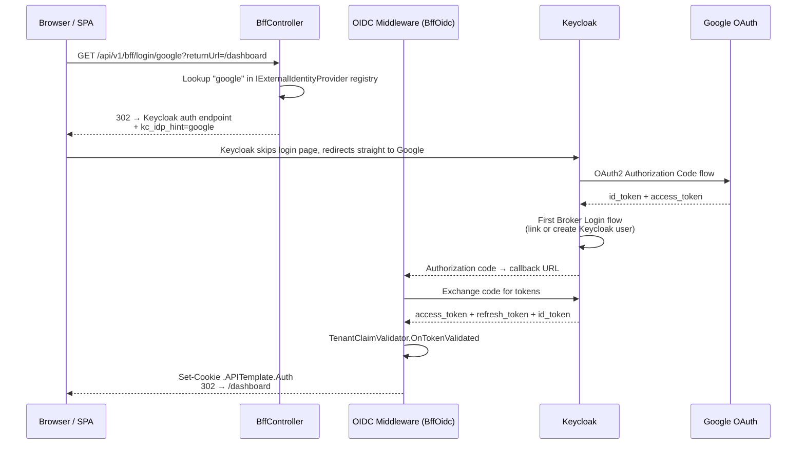
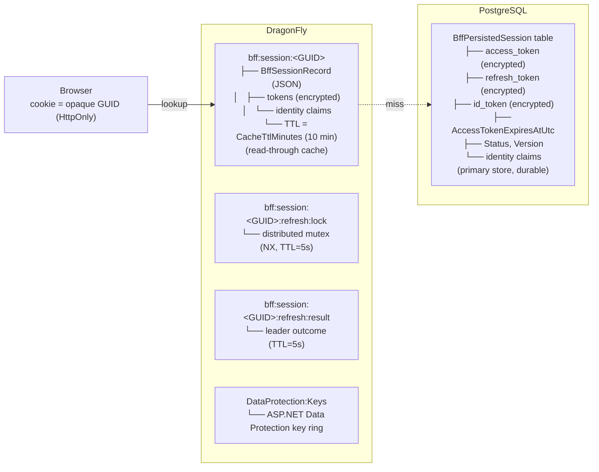

# Authentication & Authorization

## Overview

Project uses **Keycloak** as identity provider with hybrid authentication:

- **JWT Bearer** — direct API access (microservices, mobile apps, Postman, curl)
- **OIDC + Cookie (BFF)** — browser-based login for SPA; tokens never exposed to JavaScript
- **Scalar OAuth2** — interactive OAuth2 Authorization Code flow in Scalar UI (development)
- **Client Credentials** — machine-to-machine (service accounts, background jobs)

## Architecture

```mermaid
graph TB
    subgraph Clients
        SPA[Browser / SPA]
        API_CLIENT[API Client<br/>Postman, microservice, mobile]
        SCALAR[Scalar UI<br/>dev tool]
    end

    subgraph APP[ASP.NET Core API]
        BFF[BffController<br/>/api/v1/bff/login<br/>/api/v1/bff/login/{idpHint}<br/>/api/v1/bff/external-providers<br/>/api/v1/bff/logout<br/>/api/v1/bff/user<br/>/api/v1/bff/csrf]
        JWT_VAL[JwtBearer Middleware<br/>validates Bearer token]
        COOKIE_VAL[Cookie Middleware<br/>looks up session in PostgreSQL + Redis cache]
        REFRESH[CookieSessionRefresher<br/>loads session, delegates to<br/>BffTokenRefreshService]
        CSRF[CsrfValidationMiddleware<br/>X-CSRF: 1 required]
        TENANT[TenantClaimValidator<br/>validates tenant_id claim]
        CLAIM[KeycloakClaimMapper<br/>maps Keycloak → .NET claims]
        AUTHZ[Authorization Middleware<br/>Fallback: Bearer OR Cookie]
    end

    subgraph POSTGRES[PostgreSQL]
        PG_STORE[BffPersistedSession table<br/>primary session store<br/>tokens encrypted at rest]
    end

    subgraph SESSION[DragonFly / Redis]
        CACHE[Redis Cache<br/>bff:session:GUID → BffSessionRecord<br/>read-through cache, 10 min TTL]
        LOCK[Refresh Coordinator<br/>bff:session:GUID:refresh:lock<br/>bff:session:GUID:refresh:result]
        DP[DataProtection Keys<br/>DataProtection:Keys]
    end

    subgraph KEYCLOAK[Keycloak :8180]
        REALM[Realm: api-template<br/>Client: api-template]
    end

    SPA -->|Cookie .APITemplate.Auth| COOKIE_VAL
    SPA -->|POST/PUT/DELETE + X-CSRF: 1| CSRF
    API_CLIENT -->|Authorization: Bearer token| JWT_VAL
    SCALAR -->|OAuth2 Authorization Code| REALM
    BFF -->|OIDC Code Flow| REALM
    JWT_VAL --> TENANT --> CLAIM --> AUTHZ
    COOKIE_VAL --> CACHE
    CACHE -.->|miss| PG_STORE
    COOKIE_VAL --> REFRESH
    REFRESH -->|grant_type=refresh_token| REALM
    REFRESH --> LOCK
    REFRESH --> CSRF --> AUTHZ
```

---

## Authentication Methods

| Method                 | Client                         | Token visible to JS?                          |
| ---------------------- | ------------------------------ | --------------------------------------------- |
| **Scalar OAuth2**      | Scalar UI (dev tool)           | Yes (in Scalar memory only)                   |
| **JWT Bearer**         | Mobile apps, Postman, curl     | Yes (client manages it)                       |
| **Client Credentials** | Microservices, background jobs | N/A (machine-to-machine)                      |
| **BFF Cookie**         | SPA frontend (browser)         | **No** — httpOnly cookie, tokens in PostgreSQL (cached in Redis) |

---

## Quick Start

### 1. Start Infrastructure

```bash
docker compose up -d
```

| Service    | Port  | Description           |
| ---------- | ----- | --------------------- |
| PostgreSQL | 5432  | Application database  |
| MongoDB    | 27017 | Product data storage  |
| Keycloak   | 8180  | Identity provider     |
| DragonFly  | 6379  | Session store + cache |

> **PostgreSQL 18+ volume mount:** The `postgres` service uses `postgres:18.3`. Since PostgreSQL 18, the declared Docker volume moved from `/var/lib/postgresql/data` to `/var/lib/postgresql`, and `PGDATA` defaults to a version-specific subdirectory (`/var/lib/postgresql/18/docker`). The `docker-compose.yml` mounts at `/var/lib/postgresql` intentionally — this is correct for PostgreSQL 18+. Do not change it to `/var/lib/postgresql/data`.

> **Keycloak database — first-time setup:** Keycloak shares the `postgres` service and uses a dedicated `keycloak` database within it. The init script (`infrastructure/postgres/init-keycloak-db.sql`) creates this database automatically on the **first** volume initialization. If the `pgdata` volume already existed before this change, create the database once manually:
> ```bash
> docker exec api-template-monolith-postgres-1 psql -U postgres -c "CREATE DATABASE keycloak;"
> ```
> After that, restart Keycloak: `docker compose restart keycloak`.

### 2. Default Credentials

| Service                | Username | Password |
| ---------------------- | -------- | -------- |
| Keycloak Admin Console | admin    | admin    |
| Application User       | admin    | admin    |

Default user has role **PlatformAdmin** and tenant `00000000-0000-0000-0000-000000000001`.

### 3. Keycloak Admin Console

```
http://localhost:8180/admin
```

---

## Flow 1 — JWT Bearer (API clients, mobile apps)

```
Client (Postman, mobile app, microservice)
│
│  Step 1: Get token from Keycloak
│  POST http://localhost:8180/realms/api-template/protocol/openid-connect/token
│  grant_type=authorization_code | client_credentials | refresh_token
│
│  Step 2: Call API with token
│  GET /api/v1/products
│  Authorization: Bearer <access_token>
│
▼
[ JwtBearer Middleware ]
  - Downloads JWKS from Keycloak discovery endpoint
  - Validates token signature, issuer, audience, lifetime
▼
[ TenantClaimValidator.OnTokenValidated ]
  - KeycloakClaimMapper: preferred_username → ClaimTypes.Name
  - KeycloakClaimMapper: realm_access.roles[] → ClaimTypes.Role[]
  - Rejects token without tenant_id claim (unless service account)
▼
[ Authorization Middleware ]
  - Fallback policy: requires authenticated user (Bearer OR Cookie)
  - PlatformAdmin: requires role "PlatformAdmin"
▼
Controller Action
```

```mermaid
sequenceDiagram
    participant C as Client
    participant KC as Keycloak
    participant API as ASP.NET Core API

    C->>KC: POST /token<br/>(grant_type=authorization_code | client_credentials | refresh_token)
    KC-->>C: access_token
    C->>API: GET /api/v1/products<br/>Authorization: Bearer &lt;token&gt;
    API->>API: JwtBearer Middleware<br/>validates signature, issuer, audience, lifetime
    API->>API: TenantClaimValidator.OnTokenValidated<br/>maps claims, validates tenant_id
    API->>API: Authorization Middleware<br/>Fallback: Bearer OR Cookie
    API-->>C: 200 OK
```

**Get token via curl:**
```bash
TOKEN=$(curl -s -X POST "http://localhost:8180/realms/api-template/protocol/openid-connect/token" \
  -d "grant_type=client_credentials" \
  -d "client_id=api-template" \
  -d "client_secret=dev-client-secret" \
  | jq -r '.access_token')

curl -H "Authorization: Bearer $TOKEN" http://localhost:5174/api/v1/products
```

> **Tip:** Paste the token into [jwt.io](https://jwt.io) to inspect claims (roles, tenant_id, etc.)

---

## Flow 2 — Social Login via Google (BFF + Keycloak IdP brokering)

Users can log in with Google without leaving the BFF cookie flow. Keycloak acts as the broker — it handles the Google OAuth exchange and issues a standard Keycloak token to the app.

### 2a. Direct redirect to Google



**What is `kc_idp_hint`:**  
`kc_idp_hint` is a Keycloak-specific query parameter added to the OIDC authorization URL. When Keycloak receives this parameter, it **skips its own login page entirely** and redirects the user straight to the specified external identity provider (e.g. Google, GitHub). The value must match the **Alias** configured in Keycloak Admin Console → Identity Providers (e.g. `google`, `github`).

Without `kc_idp_hint`: `User → BFF /login → Keycloak login page → user clicks "Login with Google" → Google`  
With `kc_idp_hint=google`: `User → BFF /login/google → Keycloak (skipped) → Google directly`

**How it flows through the code:**

1. SPA calls `GET /api/v1/bff/login/google`
2. `BffController.LoginWithProvider` looks up `"google"` in registered `IExternalIdentityProvider` implementations
3. Sets `AuthenticationProperties.Items["kc_idp_hint"] = "google"`
4. Issues OIDC `Challenge` — ASP.NET builds the Keycloak authorization URL
5. `IdentityModule.ConfigureOidc` → `OnRedirectToIdentityProvider` event reads `kc_idp_hint` from `Properties.Items` and appends it as a query parameter to the authorization URL
6. Keycloak receives `?kc_idp_hint=google` and immediately redirects to Google OAuth

### 2b. Discovery endpoint (SPA dynamic UI)

```
GET /api/v1/bff/external-providers   (AllowAnonymous)

Response:
[
  { "idpHint": "google", "displayName": "Google" }
]
```

The SPA calls this endpoint on startup to render social login buttons dynamically — no hardcoded provider list in the frontend.

### 2c. Adding a new social provider

1. Implement `IExternalIdentityProvider` in `Identity.Security.ExternalIdentityProviders`
2. Register as singleton in `IdentityModule.RegisterApplicationServices`
3. Add the corresponding IdP in Keycloak Admin Console (or realm JSON)

No changes needed in `BffController` or `IdentityModule.ConfigureOidc`.

### 2d. Keycloak Google IdP Setup

**Development (docker compose):**

```bash
# Set before docker compose up
export GOOGLE_CLIENT_ID=your-client-id.apps.googleusercontent.com
export GOOGLE_CLIENT_SECRET=your-client-secret
docker compose restart keycloak
```

The realm JSON imports the Google IdP automatically on first start. The `${GOOGLE_CLIENT_ID:-CHANGE_ME}` placeholder is replaced by Keycloak at runtime.

**Google Cloud Console:**

1. Create OAuth 2.0 Client ID (Web application type)
2. Authorized redirect URI:
   ```
   http://localhost:8180/realms/api-template/broker/google/endpoint
   ```
3. Copy Client ID + Secret → set env vars above

**After first Google login:**  
`TenantClaimValidator.OnTokenValidated` → `UserProvisioningService.ProvisionIfNeededAsync` fires. The user must have an accepted `TenantInvitation` for their Google email to be provisioned into a tenant.

---

## Flow 3 — BFF Cookie (SPA / browser)

### 3a. Login

```mermaid
sequenceDiagram
    participant SPA as Browser / SPA
    participant BFF as BffController
    participant OIDC as OIDC Middleware (BffOidc)
    participant KC as Keycloak
    participant VK as DragonFly

    SPA->>BFF: GET /api/v1/bff/login?returnUrl=/dashboard
    BFF-->>SPA: 302 → Keycloak login page (Challenge BffOidc)
    SPA->>KC: User enters credentials
    KC-->>OIDC: Authorization code → callback URL
    OIDC->>KC: Exchange code for tokens
    KC-->>OIDC: access_token + refresh_token + id_token
    OIDC->>OIDC: TenantClaimValidator.OnTokenValidated<br/>maps claims, validates tenant_id
    OIDC->>OIDC: DragonflyTicketStore.StoreAsync<br/>→ BffSessionService.CreateSessionAsync
    Note over VK: BffSessionRecord created:<br/>tokens encrypted via IDataProtector<br/>PostgreSQL = primary, Redis = cache
    OIDC->>VK: Store BffPersistedSession (PostgreSQL)<br/>+ Redis cache (TTL = CacheTtlMinutes)
    OIDC-->>SPA: Set-Cookie: .APITemplate.Auth=&lt;GUID&gt;<br/>HttpOnly, SameSite=Lax, Secure<br/>302 → /dashboard
```

**Session record contents** — the cookie carries only the opaque `SessionId` (GUID). The server-side `BffPersistedSession` in PostgreSQL (cached in Redis) contains:

| Field | Description |
|-------|-------------|
| `SessionId` | Opaque GUID used as cookie value and store lookup key |
| `UserId`, `Subject` | User and IdP subject identifiers |
| `Provider` | Identity provider type (`Keycloak`) |
| `TenantId`, `Roles`, `Email`, `DisplayName` | Identity claims projected from the OIDC ticket |
| `AccessToken`, `RefreshToken`, `IdToken` | **Encrypted at rest** via `IDataProtector` (purpose: `bff:session:tokens`) |
| `AccessTokenExpiresAtUtc` | When the current access token expires |
| `CreatedAtUtc`, `LastSeenAtUtc`, `LastRefreshedAtUtc` | Lifecycle timestamps |
| `Status` | `Active`, `Refreshing`, `Revoked`, or `Expired` |
| `Version` | Optimistic concurrency counter (incremented on every mutation) |
| `RevokedAtUtc`, `RevocationReason` | Populated when session is revoked |

### 3b. Authenticated Request (with proactive token refresh)

```mermaid
sequenceDiagram
    participant SPA as Browser / SPA
    participant CM as Cookie Middleware
    participant VK as DragonFly
    participant CSR as CookieSessionRefresher
    participant TRS as BffTokenRefreshService
    participant COORD as DragonflyBffRefreshCoordinator
    participant KC as Keycloak
    participant CSRF as CsrfValidationMiddleware
    participant AUTHZ as Authorization Middleware

    SPA->>CM: POST /api/v1/products<br/>Cookie: .APITemplate.Auth=&lt;GUID&gt;<br/>X-CSRF: 1
    CM->>VK: DragonflyTicketStore.RetrieveAsync(&lt;GUID&gt;)<br/>→ BffSessionService.GetTicketAsync
    VK-->>CM: BffSessionRecord → AuthenticationTicket
    CM->>CSR: ValidatePrincipal event
    CSR->>VK: GetSessionAsync(sessionId)
    VK-->>CSR: BffSessionRecord (or null → 401)
    CSR->>TRS: RefreshIfRequiredAsync(session)

    alt AccessTokenExpiresAtUtc - now ≤ RefreshThresholdMinutes (2 min)
        TRS->>COORD: ExecuteAsync(sessionId, leader, follower)

        alt Leader (acquired distributed lock)
            COORD->>VK: SET bff:session:GUID:refresh:lock NX TTL=5s
            TRS->>KC: POST /token (grant_type=refresh_token)
            KC-->>TRS: new access_token + refresh_token (rotated)
            TRS->>VK: TryUpdateAsync(updatedSession, expectedVersion)<br/>optimistic concurrency check
            COORD->>VK: Write outcome to bff:session:GUID:refresh:result TTL=5s
            COORD->>VK: Release lock (compare-and-delete)
        else Follower (lock already held)
            COORD->>VK: Poll bff:session:GUID:refresh:result every 100ms<br/>timeout = RefreshWaitTimeoutMilliseconds (2s)
            COORD->>VK: Reload updated BffSessionRecord
        end

        CSR->>CSR: Rebuild principal from BffSessionRecord<br/>ShouldRenew = true → new cookie issued
    else Token still fresh
        TRS-->>CSR: BffRefreshOutcome.NotRequired
    else Refresh token missing or Keycloak rejected
        TRS->>VK: RevokeAsync(sessionId, reason)
        CSR-->>SPA: 401 Unauthorized (RejectPrincipal)
    end

    CSR->>CSRF: Validate X-CSRF: 1 header<br/>(GET/HEAD/OPTIONS exempt; JWT Bearer exempt)
    alt Missing X-CSRF header
        CSRF-->>SPA: 403 Forbidden
    end
    CSRF->>AUTHZ: Bearer OR Cookie authenticated
    AUTHZ-->>SPA: Controller Action → 200 OK
```

**Refresh coordination** prevents concurrent requests from all hitting Keycloak when the token expires:

| Role | Behavior |
|------|----------|
| **Leader** | Acquires Redis distributed lock (`NX`, TTL = `RefreshLockTimeoutMilliseconds`), calls Keycloak, updates session with `TryUpdateAsync` (optimistic concurrency), writes outcome to result key |
| **Follower** | Polls the result key every 100ms (up to `RefreshWaitTimeoutMilliseconds`), then reloads the updated session |
| **Fallback** (Redis unavailable) | In-memory semaphore per session — followers wait on the leader's `Task<BffRefreshOutcome>` |

**Keycloak refresh status mapping:**

| `KeycloakRefreshStatus` | Action |
|-------------------------|--------|
| `Success` | Update session with new tokens, set `Status = Active`, bump `Version` |
| `Rejected` (`invalid_grant`) | Revoke session (`RefreshRejected`) if `RevokeSessionOnRefreshFailure = true` |
| `ProviderError` (HTTP/network failure) | Revoke session (`ProviderSessionInvalid`) if configured |

### 3c. Logout

```mermaid
sequenceDiagram
    participant SPA as Browser / SPA
    participant BFF as BffController
    participant VK as DragonFly
    participant KC as Keycloak

    SPA->>BFF: GET /api/v1/bff/logout<br/>Cookie: .APITemplate.Auth=&lt;GUID&gt;
    BFF->>VK: DragonflyTicketStore.RemoveAsync(&lt;GUID&gt;)<br/>→ BffSessionService.RevokeAsync(Logout)
    Note over VK: Session soft-deleted in PostgreSQL<br/>removed from Redis cache<br/>(RevocationReason = Logout)
    BFF-->>SPA: Clear cookie .APITemplate.Auth
    BFF-->>SPA: 302 → Keycloak end_session_endpoint
    SPA->>KC: End session (SSO invalidated)
    KC-->>SPA: 302 → PostLogoutRedirectUri (/)
```

### 3d. Session revocation

Revocation means the session is **soft-deleted in PostgreSQL** and **removed from Redis cache**. The `BffPersistedSession` is marked with `IsDeleted = true` and `Status = Revoked`, `RevokedAtUtc`, and `RevocationReason` populated. Any subsequent request that loads a revoked session gets rejected immediately (`BffSessionService.GetSessionAsync` returns `null` for revoked sessions).

This is intentional — keeping the record allows:
- **Audit trail**: the reason and timestamp of revocation remain in PostgreSQL for 24h (cleanup job retention)
- **No race conditions**: concurrent requests see the soft-deleted status rather than a missing row
- **Consistent behavior**: the session is permanently deleted by the hourly cleanup job after the retention window

**Revocation reasons:**

| `BffSessionRevocationReason` | Trigger |
|------------------------------|---------|
| `Logout` | User-initiated sign-out via `/api/v1/bff/logout` |
| `RefreshRejected` | Keycloak returned `invalid_grant` (e.g. refresh token rotated and old one reused) |
| `RefreshTokenMissing` | Session record has no refresh token — cannot renew |
| `RefreshTokenReplaySuspected` | Suspicious refresh token reuse detected (reserved for future use) |
| `SessionCorrupted` | Session record is malformed — missing `SessionId`, `UserId`, `Subject`, or `AccessToken` |
| `ProviderSessionInvalid` | Keycloak HTTP/network error during refresh (non-`invalid_grant` failure) |
| `AbsoluteLifetimeExceeded` | `CreatedAtUtc + SessionAbsoluteLifetimeMinutes` (480 min) has passed |

### 3e. Storage architecture and Redis cache keys

**PostgreSQL** is the primary durable session store (`BffPersistedSession` table). **Redis/DragonFly** acts as a read-through cache with short TTL (`CacheTtlMinutes`, default 10 min). This design supports offline sessions (`offline_access` scope) — the refresh token in PostgreSQL survives Redis restarts and long idle periods (up to 30 days).

| Layer | Key / Table | Content | TTL | Set by |
|-------|-------------|---------|-----|--------|
| PostgreSQL | `BffPersistedSession` | Full session entity, tokens encrypted | No TTL (cleanup job) | `PostgresCachedBffSessionStore` |
| Redis | `bff:session:{id}` | `BffSessionRecord` as JSON (tokens encrypted) | `CacheTtlMinutes` (10 min), **sliding** | `PostgresCachedBffSessionStore` |
| Redis | `bff:session:{id}:refresh:lock` | Lock owner identifier (`machine:pid:guid`) | `RefreshLockTimeoutMilliseconds` (5s), fixed | `DragonflyBffRefreshCoordinator` |
| Redis | `bff:session:{id}:refresh:result` | Refresh outcome JSON (`{succeeded, failureReason}`) | `RefreshResultTtlMilliseconds` (5s), fixed | `DragonflyBffRefreshCoordinator` |

**Read path:** Redis cache hit → return. Cache miss → load from PostgreSQL → populate Redis cache → return.

**Write path:** Write to PostgreSQL (primary) → write to Redis cache.

**Sliding cache TTL** — every time the session cache key is read, the TTL is atomically reset via a Lua script (`GET` + `PEXPIRE` in one roundtrip). This keeps the cache warm for active sessions:

```
Request at 0:00  → cache TTL reset to 10 min (expires 0:10)
Request at 0:05  → cache TTL reset to 10 min (expires 0:15)
No more requests → cache key expires at 0:15
Next request     → cache miss → load from PostgreSQL → repopulate cache
```

**Three independent guards** control session lifetime:

```
┌─────────────────────────────────────────────────────────────────┐
│ Guard 1: Idle timeout (application code)                        │
│ LastSeenAtUtc + SessionIdleTimeoutMinutes exceeded.             │
│ Cleanup job deletes session from PostgreSQL → 401               │
├─────────────────────────────────────────────────────────────────┤
│ Guard 2: BFF absolute lifetime (application code)               │
│ CreatedAtUtc + SessionAbsoluteLifetimeMinutes exceeded.         │
│ Session revoked with AbsoluteLifetimeExceeded → 401             │
│ Cleanup job deletes after 24h retention.                        │
├─────────────────────────────────────────────────────────────────┤
│ Guard 3: Keycloak client session (external)                     │
│ clientSessionMaxLifespan (8h) exceeded.                         │
│ Keycloak rejects refresh_token → RefreshRejected → revoke → 401│
└─────────────────────────────────────────────────────────────────┘
```

**Session cleanup** — a periodic background job (`CleanupExpiredBffSessionsHandler`) runs hourly via TickerQ and permanently deletes sessions that are:
1. Revoked with 24h retention (audit trail)
2. Idle-expired (`LastSeenAtUtc + SessionIdleTimeoutMinutes` passed)
3. Absolute-expired (`CreatedAtUtc + SessionAbsoluteLifetimeMinutes` passed)

**Optimistic concurrency** — two layers guard against concurrent mutations. The `Version` field in `BffSessionRecord` is incremented on every mutation and checked by `TryUpdateAsync` before writing (application-level CAS). EF Core's `xmin` concurrency token guards against PostgreSQL-level races. If either check fails, `BffSessionService.MutateSessionAsync` retries (up to 3 attempts) or the refresh coordinator falls back to the follower path.

### 3f. CSRF endpoint

SPA should fetch this before making any non-GET request to learn the required header:

```
GET /api/v1/bff/csrf   (AllowAnonymous)

Response: { "headerName": "X-CSRF", "headerValue": "1" }
```

Then include `X-CSRF: 1` on every POST / PUT / PATCH / DELETE request.

---

## Flow 4 — Scalar OAuth2 (development UI)

```mermaid
sequenceDiagram
    participant DEV as Developer
    participant SC as Scalar UI
    participant KC as Keycloak
    participant API as ASP.NET Core API

    DEV->>SC: Opens /scalar/v1 → clicks Authorize
    Note over SC: BearerSecuritySchemeDocumentTransformer<br/>registers OAuth2 Authorization Code + PKCE (S256)
    SC->>KC: Redirect → Keycloak login page
    DEV->>KC: Enters admin / admin
    KC-->>SC: Authorization code → Scalar callback
    SC->>KC: Exchange code → access_token (PKCE S256)
    KC-->>SC: access_token
    SC->>API: All requests with Authorization: Bearer &lt;token&gt;
```

> Uses confidential client `api-template` with PKCE (S256). No separate public client needed.

---

## Flow 5 — Client Credentials (machine-to-machine)

```mermaid
sequenceDiagram
    participant SVC as Microservice / Background Job
    participant KC as Keycloak
    participant API as ASP.NET Core API

    SVC->>KC: POST /token<br/>grant_type=client_credentials<br/>client_id=api-template
    KC-->>SVC: access_token (service account)<br/>preferred_username = "service-account-api-template"
    SVC->>API: Request with Authorization: Bearer &lt;token&gt;
    API->>API: TenantClaimValidator<br/>IsServiceAccount() → true<br/>tenant_id check SKIPPED
    Note over API: EF global filter: HasTenant = false<br/>tenant-scoped entities return empty<br/>Non-tenant endpoints work normally
    API-->>SVC: Response
```

---

## Where Tokens Are Stored



**Storage architecture:** PostgreSQL is the primary durable session store. Redis/DragonFly acts as a read-through cache with a short TTL (`CacheTtlMinutes`, default 10 min). On cache miss, the session is loaded from PostgreSQL and populated into Redis. All writes go to PostgreSQL first, then to Redis cache. This design allows offline sessions (with `offline_access` scope) to survive across Redis restarts and long idle periods — the refresh token in PostgreSQL remains available for up to 30 days.

**Security principle:** Tokens never leave the server — the browser only holds an opaque GUID. Token fields (`access_token`, `refresh_token`, `id_token`) are encrypted at rest by `BffSessionTokenProtector` using `IDataProtector` with purpose `bff:session:tokens`.

---

## Token Claims

JWT tokens must contain these claims:

| Claim                | Description                 | Required                              |
| -------------------- | --------------------------- | ------------------------------------- |
| `sub`                | Subject (user ID)           | Yes                                   |
| `preferred_username` | Username                    | Yes                                   |
| `email`              | User email                  | Yes                                   |
| `tenant_id`          | Tenant GUID (custom claim)  | Yes (user tokens) / No (service acct) |
| `realm_access.roles` | Keycloak realm roles (JSON) | No                                    |
| `aud`                | Must include `api-template` | Yes                                   |
| `iss`                | Keycloak realm issuer URL   | Yes                                   |

**Claim mapping by `KeycloakClaimMapper`:**

| Keycloak claim         | .NET ClaimType                              |
| ---------------------- | ------------------------------------------- |
| `preferred_username`   | `ClaimTypes.Name`                           |
| `realm_access.roles[]` | `ClaimTypes.Role`                           |
| `tenant_id`            | `CustomClaimTypes.TenantId` (`"tenant_id"`) |

---

## Authorization Policies

| Policy             | Requirement                        | Used on              |
| ------------------ | ---------------------------------- | -------------------- |
| Fallback (default) | Authenticated via Bearer OR Cookie | All endpoints        |
| `PlatformAdmin`    | Role: `PlatformAdmin`              | Admin-only endpoints |

---

## BFF Endpoints

All under `/api/v1/bff/`:

| Endpoint                        | Auth required | Description                                                      |
| ------------------------------- | ------------- | ---------------------------------------------------------------- |
| `GET /bff/login`                | No            | Initiates OIDC login (Keycloak page), optional `?returnUrl=`     |
| `GET /bff/login/{idpHint}`      | No            | Direct redirect to named IdP (e.g. `google`), skips Keycloak UI |
| `GET /bff/external-providers`   | No            | Lists registered social providers `[{idpHint, displayName}]`    |
| `GET /bff/logout`               | Cookie        | Soft-deletes session in PostgreSQL, clears Redis cache, signs out of Keycloak |
| `GET /bff/user`                 | Cookie        | Returns current user claims as JSON                              |
| `GET /bff/csrf`                 | No            | Returns CSRF header name/value contract                          |

`GET /bff/login/{idpHint}` returns `404` when the hint does not match any registered `IExternalIdentityProvider`.

**`GET /bff/user` response:**
```json
{
  "userId": "unique-user-id",
  "username": "admin",
  "email": "admin@example.com",
  "tenantId": "00000000-0000-0000-0000-000000000001",
  "roles": ["PlatformAdmin"]
}
```

Returns `401` (not redirect) when unauthenticated — SPA should redirect to `/api/v1/bff/login`.

---

## Session & Token Lifecycle

| Setting | Default | Config key |
| ------- | ------- | ---------- |
| Session idle timeout (cookie + server-side) | 60 min | `Bff:SessionIdleTimeoutMinutes` |
| Redis cache TTL | 10 min | `Bff:CacheTtlMinutes` |
| Absolute session lifetime | 480 min (8h) | `Bff:SessionAbsoluteLifetimeMinutes` |
| Proactive refresh threshold | 2 min before expiry | `Bff:RefreshThresholdMinutes` |
| Follower wait timeout | 2000 ms | `Bff:RefreshWaitTimeoutMilliseconds` |
| Distributed lock TTL | 5000 ms | `Bff:RefreshLockTimeoutMilliseconds` |
| Refresh result cache TTL | 5000 ms | `Bff:RefreshResultTtlMilliseconds` |
| Revoke on refresh failure | true | `Bff:RevokeSessionOnRefreshFailure` |
| Scopes requested from OIDC | openid, profile, email, offline_access | `Bff:Scopes` |

**Token refresh trigger:** On every cookie-authenticated request, `CookieSessionRefresher.ValidatePrincipal` delegates to `BffTokenRefreshService.RefreshIfRequiredAsync`. This checks whether the access token expires within `RefreshThresholdMinutes`. If so, the `DragonflyBffRefreshCoordinator` ensures only one request performs the actual Keycloak `grant_type=refresh_token` call — concurrent requests wait for the leader result via Redis polling or in-memory fallback.

**Session validation on load** (`BffSessionService.GetSessionAsync`):
1. Check session exists in store
2. Reject if `Status` is `Revoked` or `Expired`
3. Reject and revoke if session record is malformed (missing `SessionId`, `UserId`, `Subject`, or `AccessToken`)
4. Reject and revoke if `CreatedAtUtc + SessionAbsoluteLifetimeMinutes` has passed

---

## Keycloak Realm Configuration

Realm auto-imported on `docker compose up` from `infrastructure/keycloak/realms/api-template-realm.json`.

### Realm: `api-template`

- Self-registration: Disabled
- Brute force protection: 5 attempts → lockout 1–15 min, reset after 1h
- Email login: Allowed
- SSL: None (development)
- Remember Me: Enabled (SSO session up to 15 days)
- Password policy: min 4 chars, expires after 365 days
- Refresh token rotation: Enabled (old refresh token revoked on each use)

### Token Lifetimes

| Setting | Value | Keycloak JSON key |
| ------- | ----- | ----------------- |
| Access token lifespan | 5 min (300s) | `accessTokenLifespan` |
| SSO session idle timeout | 30 min (1800s) | `ssoSessionIdleTimeout` |
| SSO session max lifespan | 10h (36000s) | `ssoSessionMaxLifespan` |
| SSO session idle (Remember Me) | 7 days (604800s) | `ssoSessionIdleTimeoutRememberMe` |
| SSO session max (Remember Me) | 15 days (1296000s) | `ssoSessionMaxLifespanRememberMe` |
| Client session idle timeout | 1h (3600s) | `clientSessionIdleTimeout` |
| Client session max lifespan | 8h (28800s) | `clientSessionMaxLifespan` |
| Offline session idle timeout | 30 days (2592000s) | `offlineSessionIdleTimeout` |
| Offline session max lifespan | 60 days (5184000s) | `offlineSessionMaxLifespan` |

### Timeout synchronization between Keycloak and BFF

The BFF session layer and Keycloak maintain **independent clocks** — neither knows the other's timeouts. They must be configured so the BFF never tries to use a token that Keycloak already considers expired.

**Full timeline for an active user:**

```
         Keycloak                                          BFF / Redis
         ────────                                          ──────────

         access_token issued (5 min lifespan)
         │                                                 BffSessionRecord created
         │                                                 Redis key: bff:session:{id}
         │                                                 Redis TTL: 60 min (sliding)
         │                                                 Cookie TTL: 60 min (sliding)
         │
  +3 min │ ← RefreshThresholdMinutes (2 min before expiry)
         │                                                 BffTokenRefreshService: refresh needed
         │                                                 POST /token grant_type=refresh_token
         │
         │ Keycloak issues new access_token (5 min)
         │ Keycloak resets client session idle (1h)        Session updated, Version++
         │ Old refresh_token revoked (rotation)            Redis TTL reset (sliding)
         │
  +6 min │                                                 Next refresh cycle...
         │
         ... repeats every ~3 minutes ...
         │
    +1h  │ If no refresh in 1h:
  (idle) │ Keycloak client session idle expires             If no request in 1h:
         │ → refresh_token becomes invalid                  Redis key expires (TTL)
         │                                                  → GetAsync returns null → 401
         │
    +8h  │ Keycloak client session max expires
  (abs)  │ → refresh_token rejected regardless              BFF absolute lifetime (480 min)
         │   of activity                                    → session revoked
         │                                                    (AbsoluteLifetimeExceeded)
```

**Constraint rules — what must be synchronized:**

| Constraint | Rule | Current values | Why |
|------------|------|----------------|-----|
| Refresh before expiry | `RefreshThresholdMinutes` < `accessTokenLifespan` | 2 min < 5 min | Otherwise the access token expires before BFF attempts refresh |
| Cookie = idle timeout | `SessionIdleTimeoutMinutes` controls both cookie and server-side idle | 60 min | Single unified setting for cookie expiry and session idle timeout |
| Redis idle ≤ Keycloak client idle | `SessionIdleTimeoutMinutes` ≤ `clientSessionIdleTimeout` | 60 min ≤ 60 min | If Redis lives longer → BFF tries to refresh with an expired client session → `invalid_grant` → revocation |
| BFF absolute ≤ Keycloak client max | `SessionAbsoluteLifetimeMinutes` ≤ `clientSessionMaxLifespan` | 480 min ≤ 480 min (8h) | If BFF lives longer → same as above, Keycloak rejects the refresh |
| Keycloak client max ≤ SSO max | `clientSessionMaxLifespan` ≤ `ssoSessionMaxLifespan` | 8h ≤ 10h | Client session cannot outlive the SSO session |

**What is independent (does not need synchronization):**

| Setting | Why independent |
|---------|-----------------|
| `RefreshLockTimeoutMilliseconds` (5s) | Internal coordination between concurrent requests — Keycloak is not involved |
| `RefreshResultTtlMilliseconds` (5s) | Internal leader/follower result sharing |
| `RefreshWaitTimeoutMilliseconds` (2s) | How long followers wait — affects individual request latency, not session validity |
| `RevokeSessionOnRefreshFailure` | BFF-only policy decision |
| `offlineSessionIdleTimeout` (30 days) | Only relevant if a separate client uses offline tokens without the BFF layer (e.g. mobile app, background job) |
| `offlineSessionMaxLifespan` (60 days) | Same as above |
| `ssoSessionIdleTimeout` (30 min) | Governs Keycloak login page SSO (single sign-on across multiple clients), not the BFF refresh flow |
| `ssoSessionIdleTimeoutRememberMe` / `ssoSessionMaxLifespanRememberMe` | Only affects the "Remember Me" checkbox on the Keycloak login page |

**What happens when constraints are violated:**

| Violation | Symptom |
|-----------|---------|
| `RefreshThresholdMinutes` ≥ `accessTokenLifespan` | Access token always expired before refresh → every request triggers refresh → Keycloak rejects expired token |
| `SessionIdleTimeoutMinutes` > `clientSessionIdleTimeout` | After Keycloak client idle expires, BFF still has a Redis session but refresh fails → `RefreshRejected` → revocation. User gets surprise 401 before BFF idle timeout |
| `SessionAbsoluteLifetimeMinutes` > `clientSessionMaxLifespan` | After Keycloak client max, BFF tries to refresh → `invalid_grant` → revocation. Absolute lifetime check in BFF code never fires because Keycloak kills it first |
| `CacheTtlMinutes` too low | More PostgreSQL fallback reads on cache miss — higher DB load. Not a correctness issue, only performance |

### Roles

| Role            | Description          |
| --------------- | -------------------- |
| `PlatformAdmin` | Full platform access |
| `User`          | Regular tenant user  |

### Client: `api-template`

| Setting              | Value                                                |
| -------------------- | ---------------------------------------------------- |
| Type                 | Confidential                                         |
| Secret               | `dev-client-secret` (dev only)                       |
| Standard Flow        | Enabled (Authorization Code + PKCE S256)             |
| Service Accounts     | Enabled (Client Credentials grant)                   |
| Direct Access Grants | Disabled (password grant removed in OAuth 2.1)       |
| PKCE                 | Required (`S256`)                                    |
| Redirect URIs        | `http://localhost:5174/*`, `http://localhost:8080/*` |

> **OAuth 2.1 compliance:** All Authorization Code flows (BFF, Scalar, mobile) enforce PKCE (`code_challenge_method=S256`).

### Custom Protocol Mappers

| Mapper          | Type              | Source attribute | JWT claim            |
| --------------- | ----------------- | ---------------- | -------------------- |
| `tenant_id`     | User Attribute    | `tenant_id`      | `tenant_id`          |
| audience-mapper | Audience Mapper   | —                | `aud`                |
| realm-roles     | Realm Role Mapper | realm roles      | `realm_access.roles` |

### Identity Providers

| Provider | Alias    | Status       | Notes                                         |
| -------- | -------- | ------------ | --------------------------------------------- |
| Google   | `google` | Configurable | Set `GOOGLE_CLIENT_ID` + `GOOGLE_CLIENT_SECRET` env vars |

Credentials use Keycloak env var interpolation (`${GOOGLE_CLIENT_ID:-CHANGE_ME}`) — no real credentials in the repo.

### Standard Keycloak Endpoints

| Endpoint      | URL                                                |
| ------------- | -------------------------------------------------- |
| Discovery     | `/realms/{realm}/.well-known/openid-configuration` |
| Token         | `/realms/{realm}/protocol/openid-connect/token`    |
| Authorization | `/realms/{realm}/protocol/openid-connect/auth`     |
| Logout        | `/realms/{realm}/protocol/openid-connect/logout`   |
| UserInfo      | `/realms/{realm}/protocol/openid-connect/userinfo` |

When the API sets `options.Authority`, ASP.NET auto-discovers all endpoints via the Discovery URL.

---

## Configuration

### appsettings.Development.json

```json
{
  "Keycloak": {
    "realm": "api-template",
    "auth-server-url": "http://localhost:8180/",
    "ssl-required": "none",
    "resource": "api-template",
    "credentials": {
      "secret": "dev-client-secret"
    }
  }
}
```

### appsettings.json — BFF section

```json
{
  "Bff": {
    "CookieName": ".APITemplate.Auth",
    "PostLogoutRedirectUri": "/",
    "SessionIdleTimeoutMinutes": 60,
    "CacheTtlMinutes": 10,
    "SessionAbsoluteLifetimeMinutes": 480,
    "Scopes": ["openid", "profile", "email", "offline_access"],
    "RefreshThresholdMinutes": 2,
    "RefreshWaitTimeoutMilliseconds": 2000,
    "RefreshLockTimeoutMilliseconds": 5000,
    "RefreshResultTtlMilliseconds": 5000,
    "RevokeSessionOnRefreshFailure": true
  }
}
```

### Production Environment Variables

| Variable                        | Description                       |
| ------------------------------- | --------------------------------- |
| `KC_HOSTNAME`                   | Keycloak external hostname        |
| `Keycloak__realm`               | Keycloak realm name               |
| `Keycloak__resource`            | Client ID                         |
| `Keycloak__credentials__secret` | Client secret                     |
| `Dragonfly__ConnectionString`   | DragonFly/Redis connection string |
| `GOOGLE_CLIENT_ID`              | Google OAuth2 Client ID           |
| `GOOGLE_CLIENT_SECRET`          | Google OAuth2 Client Secret       |

---

## Testing

### Integration Tests

Tests use mock JWT authentication that bypasses Keycloak entirely:

```csharp
// Authenticate with PlatformAdmin role
IntegrationAuthHelper.Authenticate(client, role: UserRole.PlatformAdmin);

// Authenticate with specific tenant
IntegrationAuthHelper.Authenticate(client,
    tenantId: myTenantGuid,
    role: UserRole.User);
```

Test tokens are signed with RSA-256 using an in-memory test key pair and include all required claims (`tenant_id`, roles, etc.).

**BFF/CSRF tests** use `BffSecurityWebApplicationFactory` with `FakeCookieAuthStartupFilter`:
- Set request header `X-Test-Cookie-Auth: 1` to simulate a cookie-authenticated session
- Non-GET requests without `X-CSRF: 1` return HTTP 403

**External provider unit tests** (`BffExternalProvidersTests`):
```bash
dotnet test --filter "FullyQualifiedName~BffExternalProviders"
```
Covers: `GetExternalProviders` (empty/single/multi provider), `LoginWithProvider` (known hint → ChallengeResult, unknown hint → 404, case-insensitive, `returnUrl` validation, `kc_idp_hint` set in `AuthenticationProperties`), `GoogleIdentityProvider` contract.

---

## Key Source Files

| File | Description |
| ---- | ----------- |
| `Extensions/AuthenticationServiceCollectionExtensions.cs` | All auth registration: JWT Bearer + Cookie + OIDC + policies |
| `Extensions/ApplicationBuilderExtensions.cs` | Middleware pipeline order |
| `Api/Controllers/V1/BffController.cs` | BFF endpoints: login / logout / user / csrf |
| `Api/Middleware/CsrfValidationMiddleware.cs` | CSRF header enforcement for cookie-authenticated requests |
| `Api/OpenApi/BearerSecuritySchemeDocumentTransformer.cs` | Registers OAuth2 flow in Scalar/OpenAPI spec |
| **Identity Module — Common (interfaces & models)** | |
| `Identity/Common/BffOptions.cs` | BFF configuration model (cookie, session, refresh settings) |
| `Identity/Common/Security/AuthConstants.cs` | All auth constants (schemes, claims, routes, token names, CSRF) |
| `Identity/Common/Security/IKeycloakService.cs` | Keycloak token endpoint abstraction |
| `Identity/Common/Security/Sessions/IBffSessionStore.cs` | Session persistence abstraction (CRUD + optimistic concurrency) |
| `Identity/Common/Security/Sessions/IBffSessionService.cs` | Session lifecycle service (create, load, validate, update) |
| `Identity/Common/Security/Sessions/IBffTokenRefreshService.cs` | Token refresh decision + execution |
| `Identity/Common/Security/Sessions/IBffRefreshCoordinator.cs` | Concurrent refresh coordination (leader/follower) |
| `Identity/Common/Security/Sessions/IBffSessionRevocationService.cs` | Session revocation with reason tracking |
| `Identity/Common/Security/Sessions/IBffSessionPrincipalFactory.cs` | Reconstruct `ClaimsPrincipal` / `AuthenticationTicket` from session |
| `Identity/Common/Security/Sessions/BffSessionRecord.cs` | Server-side session model (identity, tokens, lifecycle, concurrency) |
| `Identity/Common/Security/Sessions/BffSessionStatus.cs` | `Active`, `Refreshing`, `Revoked`, `Expired` |
| `Identity/Common/Security/Sessions/BffSessionRevocationReason.cs` | Why a session was revoked (Logout, RefreshRejected, etc.) |
| `Identity/Common/Security/Sessions/BffRefreshOutcome.cs` | Refresh result (NotRequired, Success, Failed) |
| `Identity/Common/Security/Sessions/BffProviderType.cs` | Identity provider enum (`Keycloak`) |
| **Identity Module — Infrastructure (implementations)** | |
| `Identity/Security/Sessions/DragonflyTicketStore.cs` | `ITicketStore` adapter → delegates to `IBffSessionService` |
| `Identity/Security/Sessions/DragonflyBffSessionStore.cs` | Redis-backed session store with Lua CAS + token encryption |
| `Identity/Security/Sessions/BffSessionService.cs` | Session lifecycle + revocation (implements both `IBffSessionService` and `IBffSessionRevocationService`) |
| `Identity/Security/Sessions/BffTokenRefreshService.cs` | Refresh decision logic + Keycloak call + session update |
| `Identity/Security/Sessions/DragonflyBffRefreshCoordinator.cs` | Redis distributed lock + in-memory fallback semaphore |
| `Identity/Security/Sessions/CookieSessionRefresher.cs` | `CookieAuthenticationEvents.ValidatePrincipal` handler |
| `Identity/Security/Sessions/BffSessionPrincipalFactory.cs` | Rebuilds principals and tickets from `BffSessionRecord` |
| `Identity/Security/Keycloak/KeycloakService.cs` | Keycloak token endpoint client (`RefreshSessionAsync`) |
| `Identity/Security/Keycloak/KeycloakRefreshResult.cs` | Refresh call result (status + token response) |
| `Identity/Security/Keycloak/KeycloakRefreshStatus.cs` | `Success`, `Rejected`, `ProviderError` |
| **Other** | |
| `Infrastructure/Security/TenantClaimValidator.cs` | Validates tenant_id claim; maps Keycloak claims |
| `Infrastructure/Security/KeycloakClaimMapper.cs` | Maps preferred_username + realm roles to .NET claim types |
| `Infrastructure/Security/KeycloakUrlHelper.cs` | Builds Keycloak authority URL |
| `Infrastructure/Health/KeycloakHealthCheck.cs` | Keycloak health check endpoint |
| `infrastructure/keycloak/realms/api-template-realm.json` | Keycloak realm auto-import (includes Google IdP config) |
| `Identity/Common/Security/IExternalIdentityProvider.cs` | Abstraction for external social providers (`IdpHint`, `DisplayName`) |
| `Identity/Security/ExternalIdentityProviders/GoogleIdentityProvider.cs` | Google IdP implementation (`kc_idp_hint=google`) |


