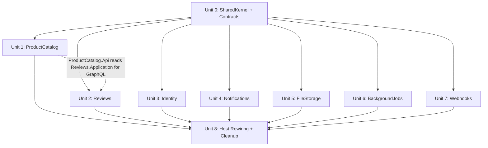

# Modular Monolith Migration — Implementation Plan

Transform the Clean Architecture monolith (4 projects) into a modular monolith with SharedKernel, Contracts, and 7 bounded context modules, following [TODO-Architecture.md](file:///c:/Users/Tad/Projects/API-Template-Monolith/TODO-Architecture.md).

## Decisions (Confirmed)

| # | Question | Answer |
|---|---------|--------|
| 1 | Namespace convention | **B** — `ProductCatalog.Domain`, `Reviews.Domain` etc. (short, independent) |
| 2 | IUnitOfWork scoping | **B** — `IUnitOfWork<TContext>` generic marker interface |
| 3 | Soft-delete cleanup | **A** — Each module registers its own strategies in `AddXxxModule()` |
| 4 | GraphQL | **ProductCatalog only** — all GraphQL stays in ProductCatalog.Api (including Reviews-related types since they're product-centric queries). Other modules expose REST only. |

---

## Constraints

> [!IMPORTANT]
> **Zero Functional Regression**: Every feature, behavior, configuration, and cross-cutting concern must work identically after migration.

> [!CAUTION]
> **DRY First**: No copy-paste across modules. Every recurring pattern is extracted into SharedKernel as generic infrastructure. Modules are thin configuration-only wrappers.

> [!IMPORTANT]
> **EF Migration Preservation**: Existing migrations remain in Infrastructure. New per-module DbContexts share the same PostgreSQL database/tables — no new migrations, no schema changes.

---

## Identified Repeating Patterns → SharedKernel Generics

### Pattern 1: DbContext boilerplate (221 lines in AppDbContext)

Every module DbContext needs: constructor with 7 deps, `ApplyGlobalFilters` reflection loop, `SetGlobalFilter<T>`, `SaveChangesAsync` override with audit stamping, `SaveChanges` throwing `NotSupportedException`.

**→ `ModuleDbContext` abstract base class**. Module DbContexts inherit and only declare DbSets (~15 lines each).

### Pattern 2: RepositoryBase (158 lines, hardcodes AppDbContext)

**→ Widen `AppDbContext` to `DbContext`**. Most repo implementations are 5 lines (constructor-only). No duplication.

### Pattern 3: UnitOfWork (314 lines, hardcodes AppDbContext)

**→ Widen `AppDbContext` to `DbContext`**. Single implementation. Modules register via `IUnitOfWork<TContext>`:

```csharp
// SharedKernel — thin marker interface
public interface IUnitOfWork<TContext> : IUnitOfWork where TContext : DbContext { }

// SharedKernel — implementation
public sealed class UnitOfWork<TContext> : IUnitOfWork<TContext> where TContext : DbContext
{
    private readonly DbContext _dbContext;
    public UnitOfWork(TContext dbContext, ...) { _dbContext = dbContext; ... }
    // All existing UnitOfWork logic — unchanged
}
```

Handler usage:
```csharp
public class CreateProductHandler(IUnitOfWork<ProductCatalogDbContext> uow) { ... }
```

### Pattern 4: SoftDelete infrastructure (hardcodes AppDbContext)

**→ Widen `AppDbContext` to `DbContext`**. Cascade rules cast to their module's context: `if (dbContext is not ProductCatalogDbContext db) return [];`

### Pattern 5: EF Configuration extensions (76 lines)

`ConfigureTenantAuditable<T>()` used by every entity config. **→ Move to SharedKernel as-is.**

### Pattern 6: Module DI registration boilerplate

**→ `ModuleRegistrationBuilder<TContext>` fluent API**. Each module becomes a chain:

```csharp
// ProductCatalogModule.cs — entire DI registration
services.AddModule<ProductCatalogDbContext>(configuration)
    .AddRepository<IProductRepository, ProductRepository>()
    .AddRepository<ICategoryRepository, CategoryRepository>()
    .AddCascadeRule<ProductSoftDeleteCascadeRule>()
    .AddCleanupStrategies(typeof(Product), typeof(Category), typeof(ProductDataLink));
```

The builder handles: DbContext registration, `IUnitOfWork<TContext>`, `IDbTransactionProvider`, Npgsql connection, soft-delete cleanup strategy registration.

### Pattern 7: Configuration utilities

`SectionFor<T>()`, `AddValidatedOptions<T>()`, `ConfigurationSections`, `ResilienceDefaults`. **→ Move to SharedKernel.**

### Pattern 8: Queue + Background Service registration

`AddQueueWithConsumer<TImpl, TQueue, TReader, TService>()`. **→ Move to SharedKernel.**

---

## Architecture Overview

```
src/
├── SharedKernel/SharedKernel.csproj
│   ├── Domain/           # Contracts, value objects, exceptions, interfaces (IUnitOfWork<T>)
│   ├── Application/      # DTOs, validation, errors, context, middleware
│   └── Infrastructure/   # ModuleDbContext, RepositoryBase, UnitOfWork<T>,
│                         # SoftDelete, Auditing, Config utils, ModuleRegistrationBuilder
├── Contracts/Contracts.csproj  # Integration events only
├── Modules/
│   ├── ProductCatalog/{Domain,Application,Infrastructure,Api}/  ← owns all GraphQL
│   ├── Reviews/{Domain,Application,Infrastructure,Api}/
│   ├── Identity/{Domain,Application,Infrastructure,Api}/
│   ├── Notifications/{Domain,Application,Infrastructure,Api}/
│   ├── FileStorage/{Domain,Application,Infrastructure,Api}/
│   ├── BackgroundJobs/{Domain,Application,Infrastructure,Api}/
│   └── Webhooks/{Domain,Application,Infrastructure,Api}/
├── APITemplate.Api/          # Host (composes modules, cross-cutting)
├── APITemplate.{Domain,Application,Infrastructure}/  # LEGACY during Units 1-7
```

---

## Proposed Changes

### Unit 0: Foundation — SharedKernel + Contracts

#### [NEW] `src/SharedKernel/SharedKernel.csproj`

Namespace root: `SharedKernel`

**Domain layer** — from `APITemplate.Domain`:

| Source | SharedKernel path |
|--------|------------------|
| `Entities/Contracts/` (5 interfaces) | `Domain/Contracts/` |
| `Entities/AuditInfo.cs`, `AuditDefaults.cs` | `Domain/` |
| `Common/PagedResponse.cs` | `Domain/` |
| `Interfaces/IRepository.cs`, `IUnitOfWork.cs`, `IStoredProcedure.cs`, `IStoredProcedureExecutor.cs` | `Domain/Interfaces/` |
| `Exceptions/` (all 6) | `Domain/Exceptions/` |
| `Options/TransactionOptions.cs` | `Domain/Options/` |

**NEW in Domain**:
| File | Purpose |
|------|---------|
| `Domain/Interfaces/IUnitOfWork{TContext}.cs` | `IUnitOfWork<TContext> : IUnitOfWork where TContext : DbContext` |

**Application layer** — from `APITemplate.Application/Common`:

| Source | SharedKernel path |
|--------|------------------|
| `Context/` (ITenantProvider, IActorProvider) | `Application/Context/` |
| `DTOs/` (all 5) | `Application/DTOs/` |
| `Batch/` (all + Rules/) | `Application/Batch/` |
| `Contracts/ISortableFilter.cs`, `IDateRangeFilter.cs` | `Application/Contracts/` |
| `Sorting/` (2 files) | `Application/Sorting/` |
| `Validation/` (all 6) | `Application/Validation/` |
| `Errors/` (2 files) | `Application/Errors/` |
| `Extensions/RepositoryExtensions.cs` | `Application/Extensions/` |
| `Search/SearchDefaults.cs` | `Application/Search/` |
| `Http/` (2 files) | `Application/Http/` |
| `Resilience/ResiliencePipelineKeys.cs` | `Application/Resilience/` |
| `Middleware/ErrorOrValidationMiddleware.cs` | `Application/Middleware/` |
| `Options/` (AppOptions, BootstrapTenantOptions, TransactionDefaultsOptions) | `Application/Options/` |
| `Startup/` (2 files) | `Application/Startup/` |

**Infrastructure layer** — generalized:

| Source | SharedKernel path | Change |
|--------|------------------|--------|
| `Persistence/Auditing/` (both) | `Infrastructure/Auditing/` | None |
| `Persistence/EntityNormalization/IEntityNormalizationService.cs` | `Infrastructure/EntityNormalization/` | None |
| `Persistence/SoftDelete/` (3 files) | `Infrastructure/SoftDelete/` | `AppDbContext` → `DbContext` |
| `Persistence/UnitOfWork/` (8 files) | `Infrastructure/UnitOfWork/` | `AppDbContext` → `DbContext`, add `UnitOfWork<TContext>` |
| `Repositories/RepositoryBase.cs` | `Infrastructure/Repositories/` | `AppDbContext` → `DbContext` |
| `Repositories/Pagination/` (2 files) | `Infrastructure/Repositories/Pagination/` | None |
| `Persistence/Configurations/TenantAuditableEntityConfigurationExtensions.cs` | `Infrastructure/Configurations/` | None |
| Api: `Extensions/Configuration/` (4 files) | `Infrastructure/Configuration/` | None |
| Api: `Extensions/Resilience/ResilienceDefaults.cs` | `Infrastructure/Resilience/` | None |
| Api: `AddQueueWithConsumer<>` method | `Infrastructure/Registration/QueueRegistrationExtensions.cs` | None |

**NEW infrastructure** (eliminates duplication):

| File | Purpose |
|------|---------|
| `Infrastructure/Persistence/ModuleDbContext.cs` | ~150 lines from AppDbContext: constructor, global filters, SaveChangesAsync, audit pipeline. Modules inherit + declare DbSets only. |
| `Infrastructure/Registration/ModuleRegistrationBuilder.cs` | Fluent builder: registers DbContext, `IUnitOfWork<TContext>`, `IDbTransactionProvider`, cleanup strategies. |
| `Infrastructure/Registration/ModuleRegistrationExtensions.cs` | Entry point: `services.AddModule<TContext>(configuration)` |

**Legacy compatibility**: Old projects get `ProjectReference` to SharedKernel. Moved files replaced with `global using` re-exports:
```csharp
// src/APITemplate.Domain/Entities/Contracts/IAuditableTenantEntity.cs (after move)
global using IAuditableTenantEntity = SharedKernel.Domain.Contracts.IAuditableTenantEntity;
```

---

#### [NEW] `src/Contracts/Contracts.csproj`

Namespace root: `Contracts`. References SharedKernel only.

| Source | Contracts path |
|--------|---------------|
| `Application/Common/Events/CacheEvents.cs` | `Events/Cache/` |
| `Application/Common/Events/CacheTags.cs` | `Events/Cache/` |
| `Application/Common/Events/EmailEvents.cs` | `Events/Email/` |
| `Application/Common/Events/SoftDeleteEvents.cs` | `Events/SoftDelete/` |
| `Application/Common/Events/MessageBusExtensions.cs` | `Extensions/` |

**NEW integration events**:

| Event | Published by | Consumed by |
|-------|-------------|-------------|
| `ProductSoftDeletedNotification` | ProductCatalog | Reviews |
| `TenantSoftDeletedNotification` (exists) | Identity | ProductCatalog, Notifications, FileStorage, BackgroundJobs |

---

### Units 1–7: Module Projects

Each module follows the same skeleton using SharedKernel generics:

- **Domain**: Entities + repo interfaces → references `SharedKernel`
- **Application**: Features (commands, queries, DTOs, validators, specs) → references Domain + SharedKernel + Contracts
- **Infrastructure**: Module DbContext (inherits `ModuleDbContext`, ~15 lines) + concrete repos (inherit `RepositoryBase<T>`, ~5 lines) + EF configs (call `ConfigureTenantAuditable<T>()`) + cascade rules → references Application + SharedKernel
- **Api**: Controllers + `AddXxxModule()` registration using fluent builder → references Infrastructure + Application

---

#### Unit 1: ProductCatalog

| Layer | Contents |
|-------|----------|
| **Domain** | `Product`, `Category`, `ProductDataLink`, `ProductCategoryStats`, `ProductData/` (MongoDB), repo interfaces (4) |
| **Application** | `Features/Product/`, `Features/Category/`, `Features/ProductData/`, `Contracts/IProductRequest.cs` |
| **Infrastructure** | `ProductCatalogDbContext` (4 DbSets), repos (4), EF configs (4), MongoDB context/settings/migrations, `ProductSoftDeleteCascadeRule` (cascades ProductDataLinks only; publishes `ProductSoftDeletedNotification`), stored procedures |
| **Api** | `ProductsController`, `CategoriesController`, `ProductDataController`, **all GraphQL** (Product + Category + ProductReview types, queries, mutations, data loaders), `ProductCatalogModule.cs` |

> [!NOTE]
> ProductCatalog.Api is the sole GraphQL owner. It references Reviews.Application to resolve review queries/mutations. This is an intentional cross-module read dependency at the presentation layer — the domain boundary is still clean.

---

#### Unit 2: Reviews

| Layer | Contents |
|-------|----------|
| **Domain** | `ProductReview`, `IProductReviewRepository` |
| **Application** | `Features/ProductReview/` (commands, queries, DTOs, validators, specs), `ProductSoftDeletedEventHandler` (handles cross-module cascade via Wolverine event) |
| **Infrastructure** | `ReviewsDbContext` (1 DbSet), `ProductReviewRepository`, `ProductReviewConfiguration` |
| **Api** | `ProductReviewsController`, `ReviewsModule.cs` — **no GraphQL** |

---

#### Unit 3: Identity

| Layer | Contents |
|-------|----------|
| **Domain** | `AppUser`, `Tenant`, `TenantInvitation`, `UserRole`, `InvitationStatus`, repo interfaces (3) |
| **Application** | `Features/User/`, `Features/Tenant/`, `Features/TenantInvitation/`, `Features/Bff/`, `Common/Security/` (AuthConstants, permissions, IKeycloakAdminService, IRolePermissionMap, StaticRolePermissionMap, IUserProvisioningService), security options (KeycloakOptions, BffOptions, SystemIdentityOptions, CorsOptions) |
| **Infrastructure** | `IdentityDbContext` (3 DbSets), repos (3), EF configs (3), `AppUserEntityNormalizationService`, `AuthBootstrapSeeder`, Security/ (Keycloak/, Tenant/ — providers, DragonflyTicketStore), `TenantSoftDeleteCascadeRule` (cascades Users + TenantInvitations; publishes `TenantSoftDeletedNotification`) |
| **Api** | `UsersController`, `TenantsController`, `TenantInvitationsController`, `BffController`, `Authorization/` (PermissionAuthorizationHandler, PermissionPolicyProvider, CsrfValidationMiddleware, TenantClaimValidator, CookieSessionRefresher), `IdentityModule.cs` |

---

#### Unit 4: Notifications

| Layer | Contents |
|-------|----------|
| **Domain** | `FailedEmail`, `IFailedEmailRepository` |
| **Application** | `Common/Email/` (all interfaces), event handlers (3 email notification handlers), `IEmailRetryService`, `EmailOptions` |
| **Infrastructure** | `NotificationsDbContext` (1 DbSet), `FailedEmailRepository`, `FailedEmailConfiguration`, Email/ (queue, sender, templates, background service, failed email store), `EmailRetryService`, `EmailRetryRecurringJobRegistration`, stored procedures |
| **Api** | No controllers (event-driven). `NotificationsModule.cs` |

---

#### Unit 5: FileStorage

| Layer | Contents |
|-------|----------|
| **Domain** | `StoredFile`, `IStoredFileRepository` |
| **Application** | `IFileStorageService`, `FileStorageOptions`, file features |
| **Infrastructure** | `FileStorageDbContext` (1 DbSet), `StoredFileRepository`, `StoredFileConfiguration`, `LocalFileStorageService` |
| **Api** | `FilesController`, `FileStorageModule.cs` |

---

#### Unit 6: BackgroundJobs

| Layer | Contents |
|-------|----------|
| **Domain** | `JobExecution`, `JobStatus`, `IJobExecutionRepository` |
| **Application** | `Common/BackgroundJobs/` (all except IEmailRetryService), `BackgroundJobsOptions`, job features |
| **Infrastructure** | `BackgroundJobsDbContext` (1 DbSet), `JobExecutionRepository`, `JobExecutionConfiguration`, TickerQ/ (scheduler, coordination, cleanup/reindex jobs), Services/ (CleanupService, ReindexService, ExternalIntegrationSyncService, JobQueue, JobProcessingBackgroundService), Validation/ |
| **Api** | `JobsController`, `BackgroundJobsModule.cs` |

---

#### Unit 7: Webhooks

| Layer | Contents |
|-------|----------|
| **Domain** | None (in-memory queues only) |
| **Application** | Webhook interfaces (IWebhookEventHandler, IWebhookPayloadSigner, IWebhookPayloadValidator), `WebhookOptions`, queue interfaces, DTOs/constants |
| **Infrastructure** | All `Infrastructure/Webhooks/` (8 files — queues, HMAC, background services) |
| **Api** | `WebhooksController`, `Filters/Webhooks/WebhookSignatureResourceFilter`, `WebhooksModule.cs` |

---

### Unit 8: Host Rewiring + Legacy Cleanup

#### [MODIFY] [Program.cs](file:///c:/Users/Tad/Projects/API-Template-Monolith/src/APITemplate.Api/Program.cs)

```csharp
// Replace monolithic extension calls with:
builder.Services.AddProductCatalogModule(builder.Configuration);  // includes GraphQL
builder.Services.AddReviewsModule(builder.Configuration);
builder.Services.AddIdentityModule(builder.Configuration);
builder.Services.AddNotificationsModule(builder.Configuration);
builder.Services.AddFileStorageModule(builder.Configuration);
builder.Services.AddBackgroundJobsModule(builder.Configuration);
builder.Services.AddWebhooksModule(builder.Configuration);
```

**Remains in host** (cross-cutting):
- Serilog + OTLP, OpenTelemetry tracing/metrics
- Rate limiting, CORS, Exception handling
- RequestContextMiddleware, API versioning, OpenAPI/Scalar
- Output cache policies (CacheTags from Contracts)
- Dragonfly/Redis/DataProtection
- Idempotency filter + store
- Example controllers: IdempotentController, PatchController, SseController

#### [MODIFY] [APITemplate.Api.csproj](file:///c:/Users/Tad/Projects/API-Template-Monolith/src/APITemplate.Api/APITemplate.Api.csproj)
Remove old project refs. Add module Api project refs + SharedKernel + Contracts.

#### [MODIFY] [APITemplate.slnx](file:///c:/Users/Tad/Projects/API-Template-Monolith/APITemplate.slnx)
Add all new projects in solution folders.

#### [MODIFY] [APITemplate.Tests.csproj](file:///c:/Users/Tad/Projects/API-Template-Monolith/tests/APITemplate.Tests/APITemplate.Tests.csproj)
Replace old references with module references.

#### [DELETE] `src/APITemplate.Domain/`
#### [DELETE] `src/APITemplate.Application/`
#### [DELETE] `src/APITemplate.Infrastructure/` — **EXCEPT** `Migrations/` → preserved as `src/Migrations/Legacy/`

---

## DRY Verification Checklist

| What | Times written | Where |
|------|:---:|-------|
| Global query filter logic | **1** | `ModuleDbContext.ApplyGlobalFilters()` |
| SaveChangesAsync audit pipeline | **1** | `ModuleDbContext.SaveChangesAsync()` |
| Repository CRUD overrides | **1** | `RepositoryBase<T>` |
| Paged query infrastructure | **1** | `RepositoryBase<T>.GetPagedAsync()` |
| UnitOfWork transaction logic | **1** | `UnitOfWork<TContext>` |
| EfCoreTransactionProvider | **1** | Takes `DbContext` |
| SoftDeleteProcessor recursive cascade | **1** | `SoftDeleteProcessor` |
| Audit field stamping | **1** | `AuditableEntityStateManager` |
| TenantAuditable EF configuration | **1** | `ConfigureTenantAuditable<T>()` |
| Configuration section convention | **1** | `SectionFor<T>()` |
| Options binding + validation | **1** | `AddValidatedOptions<T>()` |
| Module DbContext+UoW+TransactionProvider DI | **1** | `AddModule<TContext>()` builder |
| Queue + BackgroundService DI | **1** | `AddQueueWithConsumer<>()` |
| GraphQL server | **1** | ProductCatalog.Api |

---

## Dependency Graph



Units 1–7 independent (except U1 has optional read dependency on U2 for GraphQL).

---

## Verification Plan

### Per-Unit
```powershell
dotnet build APITemplate.slnx
dotnet test APITemplate.slnx --no-build
```

### Unit 8 (final)
- Full build + test after legacy deletion
- Configuration binding: all Options classes resolve from same config sections
- DI resolution: all interfaces resolve — especially `IUnitOfWork<TContext>` per module
- Wolverine: all handlers discoverable across module assemblies
- GraphQL: schema export matches original

---

### Unit 5: FileStorage Module - Detailed Extraction Plan

| Source File from `absolute/` | Destination in `src/Modules/FileStorage/` | Layer |
| -------------------------- | --------------------------------------- | ----- |
| `src/APITemplate.Domain/Entities/StoredFile.cs` | `FileStorage.Domain/StoredFile.cs` | Domain |
| `src/APITemplate.Domain/Interfaces/IStoredFileRepository.cs` | `FileStorage.Domain/IStoredFileRepository.cs` | Domain |
| `src/APITemplate.Application/Features/Examples/Commands/UploadFileCommand.cs` | `FileStorage.Application/Features/Upload/UploadFileCommand.cs` | Application |
| `src/APITemplate.Application/Features/Examples/Queries/DownloadFileQuery.cs` | `FileStorage.Application/Features/Download/DownloadFileQuery.cs` | Application |
| `src/APITemplate.Application/Features/Examples/DTOs/` (File DTOs) | `FileStorage.Application/Features/DTOs/` | Application |
| `src/APITemplate.Infrastructure/FileStorage/LocalFileStorageService.cs` | `FileStorage.Infrastructure/LocalFileStorageService.cs` | Infrastructure |
| **[NEW]** `FileStorageDbContext.cs` | `FileStorage.Infrastructure/FileStorageDbContext.cs` | Infrastructure |
| **[NEW]** `StoredFileRepository.cs` | `FileStorage.Infrastructure/StoredFileRepository.cs` | Infrastructure |
| **[NEW]** `StoredFileConfiguration.cs` | `FileStorage.Infrastructure/StoredFileConfiguration.cs` | Infrastructure |
| `src/APITemplate.Api/Api/Controllers/V1/FilesController.cs` | `FileStorage.Api/FilesController.cs` | Api |
| **[NEW]** `FileStorageModule.cs` | `FileStorage.Api/FileStorageModule.cs` | Api |

### Unit 6: BackgroundJobs Module - Detailed Extraction Plan

| Source File from `absolute/` | Destination in `src/Modules/BackgroundJobs/` | Layer |
| -------------------------- | ------------------------------------------ | ----- |
| `src/APITemplate.Domain/Entities/JobExecution.cs` | `BackgroundJobs.Domain/JobExecution.cs` | Domain |
| `src/APITemplate.Domain/Interfaces/IJobExecutionRepository.cs` | `BackgroundJobs.Domain/IJobExecutionRepository.cs` | Domain |
| `src/APITemplate.Application/Features/Examples/Commands/SubmitJob...` | `BackgroundJobs.Application/Features/Jobs/SubmitJobCommand.cs` | Application |
| `src/APITemplate.Application/Features/Examples/Queries/GetJobStatus...` | `BackgroundJobs.Application/Features/Jobs/GetJobStatusQuery.cs` | Application |
| `src/APITemplate.Application/Features/Examples/DTOs/` (Job DTOs) | `BackgroundJobs.Application/Features/Jobs/DTOs/` | Application |
| `src/APITemplate.Infrastructure/BackgroundJobs/TickerQ/` (all files) | `BackgroundJobs.Infrastructure/TickerQ/` | Infrastructure |
| `src/APITemplate.Infrastructure/BackgroundJobs/Services/` (all files) | `BackgroundJobs.Infrastructure/Services/` | Infrastructure |
| `src/APITemplate.Infrastructure/BackgroundJobs/Validation/` (all files) | `BackgroundJobs.Infrastructure/Validation/` | Infrastructure |
| **[NEW]** `BackgroundJobsDbContext.cs` | `BackgroundJobs.Infrastructure/BackgroundJobsDbContext.cs` | Infrastructure |
| **[NEW]** `JobExecutionRepository.cs` | `BackgroundJobs.Infrastructure/JobExecutionRepository.cs` | Infrastructure |
| **[NEW]** `JobExecutionConfiguration.cs` | `BackgroundJobs.Infrastructure/JobExecutionConfiguration.cs` | Infrastructure |
| `src/APITemplate.Api/Api/Controllers/V1/JobsController.cs` | `BackgroundJobs.Api/JobsController.cs` | Api |
| **[NEW]** `BackgroundJobsModule.cs` | `BackgroundJobs.Api/BackgroundJobsModule.cs` | Api |

> [!IMPORTANT]
> **User Review Required** I have updated the plan with a rigorous, file-by-file mapping table from the legacy `absolute` monolith into the new modular design for Units 5 and 6, showing exactly how `Examples` features will be reorganized. Please review and approve this file mapping so I can begin execution.
